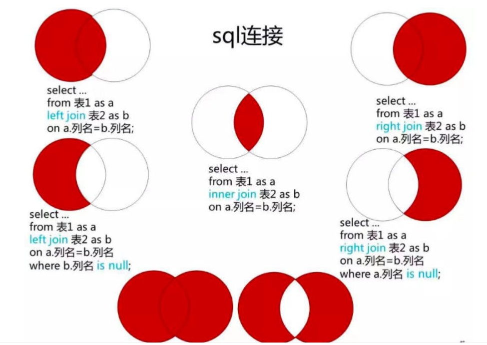
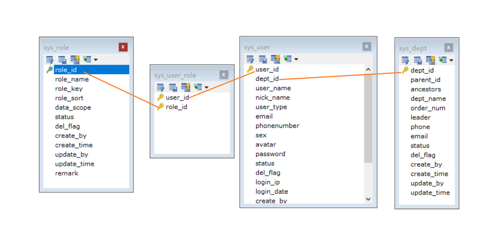

# @InitBinder注解

在@Controller注解中为控制器注册一个绑定器初始化的方法，@InitBinder注解可以对WebDataBinder进行初始化。[https://blog.csdn.net/qq_38016931/article/details/82080940](https://blog.csdn.net/qq_38016931/article/details/82080940)

```java
public class BaseController{
	/**
     * 将前台传递过来的日期格式的字符串，自动转化为Date类型
     */
    @InitBinder
    public void initBinder(WebDataBinder binder)
    {
        // Date 类型转换
        binder.registerCustomEditor(Date.class, new PropertyEditorSupport()
        {
            @Override
            public void setAsText(String text)
            {
                setValue(DateUtils.parseDate(text));
            }
        });
    }
}
```

# PageHelper的使用

```xml
<!-- pagehelper 分页插件 -->
<dependency>
    <groupId>com.github.pagehelper</groupId>
    <artifactId>pagehelper-spring-boot-starter</artifactId>
    <version>1.2.5</version>
</dependency>
```

封装PageDomain(分页数据)

```java
public class PageDomain
{
    /** 当前记录起始索引 */
    private Integer pageNum;
    /** 每页显示记录数 */
    private Integer pageSize;
    /** 排序列 */
    private String orderByColumn;
    /** 排序的方向 "desc" 或者 "asc". */
    private String isAsc;

    public String getOrderBy()
    {
        if (StringUtils.isEmpty(orderByColumn))
        {
            return "";
        }
        return StringUtils.toUnderScoreCase(orderByColumn) + " " + isAsc;
    }
}
```

分装分页数据对象

```java
public class TableDataInfo implements Serializable
{
    private static final long serialVersionUID = 1L;

    /** 总记录数 */
    private long total;

    /** 列表数据 */
    private List<?> rows;

    /** 消息状态码 */
    private int code;

    /** 消息内容 */
    private String msg;

    /** 表格数据对象*/
    public TableDataInfo(){}

    /**
     * 分页
     * 
     * @param list 列表数据
     * @param total 总记录数
     */
    public TableDataInfo(List<?> list, int total){
        this.rows = list;
        this.total = total;
    }
}
```

封装数据处理类

```java
public class TableSupport
{
    /**
     * 当前记录起始索引
     */
    public static final String PAGE_NUM = "pageNum";

    /**
     * 每页显示记录数
     */
    public static final String PAGE_SIZE = "pageSize";

    /**
     * 排序列
     */
    public static final String ORDER_BY_COLUMN = "orderByColumn";

    /**
     * 排序的方向 "desc" 或者 "asc".
     */
    public static final String IS_ASC = "isAsc";

    /**
     * 封装分页对象
     */
    public static PageDomain getPageDomain(){
        PageDomain pageDomain = new PageDomain();
        pageDomain.setPageNum(ServletUtils.getParameterToInt(PAGE_NUM));
        pageDomain.setPageSize(ServletUtils.getParameterToInt(PAGE_SIZE));
        pageDomain.setOrderByColumn(ServletUtils.getParameter(ORDER_BY_COLUMN));
        pageDomain.setIsAsc(ServletUtils.getParameter(IS_ASC));
        return pageDomain;
    }
    public static PageDomain buildPageRequest(){
        return getPageDomain();
    }
}
```

在BaseController中定义统一的方法：

```java
public class BaseController{    
	/**
     * 设置请求分页数据
     */
    protected void startPage()
    {
        //从请求中获取分页数据，封装分页对象
        PageDomain pageDomain = TableSupport.buildPageRequest();
        Integer pageNum = pageDomain.getPageNum();
        Integer pageSize = pageDomain.getPageSize();
        //对数据进行校验
        if (StringUtils.isNotNull(pageNum) && StringUtils.isNotNull(pageSize))
        {
            String orderBy = SqlUtil.escapeOrderBySql(pageDomain.getOrderBy());
            //调用startPage方法，实际上封装了一个Page对象，存进了ThreadLocal中
            PageHelper.startPage(pageNum, pageSize, orderBy);
        }
    }

    /**
     * 响应请求分页数据
     */
    @SuppressWarnings({ "rawtypes", "unchecked" })
    protected TableDataInfo getDataTable(List<?> list)
    {
        TableDataInfo rspData = new TableDataInfo();
        rspData.setCode(HttpStatus.SUCCESS);
        rspData.setMsg("查询成功");
        rspData.setRows(list);
        rspData.setTotal(new PageInfo(list).getTotal());
        return rspData;
    }
}
```

业务Controller继承BaseController，请求分页数据时，首先调用startPage方法。

```java
@RestController
@RequestMapping("/system/user")
public class SysUserController extends BaseController
{
    /**
     * 获取用户列表
     */
    @PreAuthorize("@ss.hasPermi('system:user:list')")
    @GetMapping("/list")
    public TableDataInfo list(SysUser user)
    {
        startPage();
        List<SysUser> list = userService.selectUserList(user);
        return getDataTable(list);
    }
}
```

# Mybatis多表查询及Mapper.xml的编写

数据库：MySQL

数据库方面，多表查询一直都是我的弱项，平时只满足于基本的增删改查，但是许多时候，优秀的数据库设计必然是会存在多张表连结的，这次，跟着若依项目，再回顾一下一些基本多表查询的写法。



模拟案例：

- 用户表sys_user：存储用户信息。
- 部门表sys_dept：存储部门信息。
- 角色表sys_role：存储角色信息，如管理员，普通用户。
- 用户角色表sys_user_role：因为用户和角色是多对多关系，此时需要第三张表建立两表联系。



此时，如果希望查询一个没有删除标记的用户SysUser的基本信息，并携带部门名称，角色名称，SQL语句如下：

```mysql
select su.*,sd.dept_name,sr.role_name
from sys_user su
left join sys_dept sd on su.dept_id = sd.dept_id
left join sys_user_role sur on su.user_id = sur.user_id
left join sys_role sr on sur.role_id = sr.role_id
where su.del_flag = '0'
```


