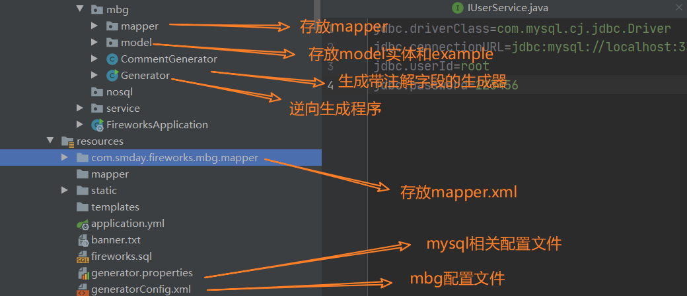
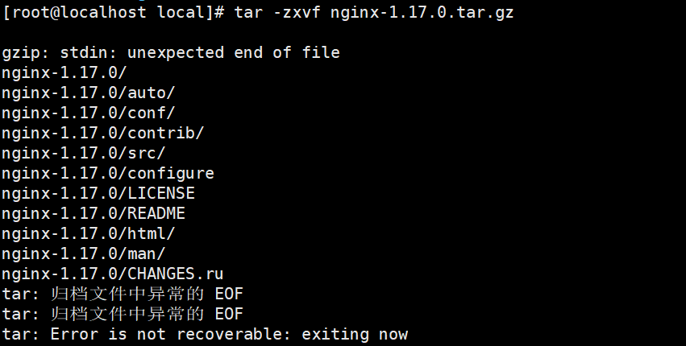
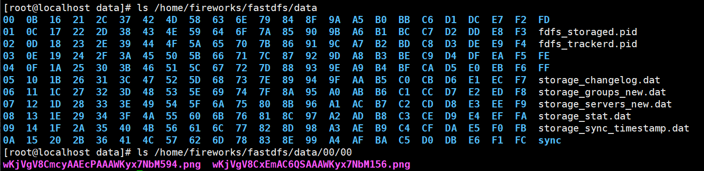

[toc]

# Springboot整合JavaMail

javax.mail.internet.AddressException: Local address contains control or whitespace`

这个错误是在使用SpringBoot整合JavaMail使用时遇到的，网上有各种各样的问题解决，找了许久，最后发现是自己粗心大意，把接收地址整错了，接收地址出现了空格也就是`whitespace`。

对了，顺便将简单整合记一下：

```yml
spring:
  mail:
    host: smtp.qq.com
    port: 465
    username: 1332790762@qq.com
    from: 1332790762@qq.com
    # 授权码
    password: xxx # 需要开启smtp之类的服务获取授权码
    default-encoding: utf-8
    properties:
      mail:
        smtp:
          auth: true
          starttls:
            enable: true
            required: true
          ssl:
            enable: true
```

```java
@Component
public class JavaMailComponent {
  private final Logger logger = LoggerFactory.getLogger(this.getClass());
    
  @Value("${spring.mail.from}")
  private String from;
    
  @Autowired
  private JavaMailSenderImpl javaMailSender;
    
  public void send(String subject, String to,String content) {
    MimeMessage message = javaMailSender.createMimeMessage();
    MimeMessageHelper helper = null;
    try {
      helper = new MimeMessageHelper(message, true);
      helper.setFrom(from);
      helper.setSubject(subject);
      helper.setTo(to);
      helper.setText(content, true);
      javaMailSender.send(message);
      //日志信息
      logger.info("邮件已经发送。");
    } catch (MessagingException e) {
      logger.error("发送邮件时发生异常！", e);
    }
  }
}
```

# SpringBoot整合Mybatis逆向工程

该部分参考：[http://www.macrozheng.com/#/architect/mall_arch_01](http://www.macrozheng.com/#/architect/mall_arch_01)



编写generatorConfig.xml，配置逆向生成的一些规则：

```xml
<?xml version="1.0" encoding="UTF-8"?>
<!DOCTYPE generatorConfiguration
        PUBLIC "-//mybatis.org//DTD MyBatis Generator Configuration 1.0//EN"
        "http://mybatis.org/dtd/mybatis-generator-config_1_0.dtd">

<generatorConfiguration>
    <properties resource="generator.properties"/>
    <context id="MySqlContext" targetRuntime="MyBatis3" defaultModelType="flat">
        <property name="beginningDelimiter" value="`"/>
        <property name="endingDelimiter" value="`"/>
        <property name="javaFileEncoding" value="UTF-8"/>
        <!-- 为模型生成序列化方法-->
        <plugin type="org.mybatis.generator.plugins.SerializablePlugin"/>
        <!-- 为生成的Java模型创建一个toString方法 -->
        <plugin type="org.mybatis.generator.plugins.ToStringPlugin"/>
        <!--生成mapper.xml时覆盖原文件-->
        <plugin type="org.mybatis.generator.plugins.UnmergeableXmlMappersPlugin" />
        <!--可以自定义生成model的代码注释-->
        <commentGenerator type="com.smday.fireworks.mbg.CommentGenerator">
            <!-- 是否去除自动生成的注释 true：是 ： false:否 -->
            <property name="suppressAllComments" value="true"/>
            <property name="suppressDate" value="true"/>
            <property name="addRemarkComments" value="true"/>
        </commentGenerator>
        <!--配置数据库连接-->
        <jdbcConnection driverClass="${jdbc.driverClass}"
                        connectionURL="${jdbc.connectionURL}"
                        userId="${jdbc.userId}"
                        password="${jdbc.password}">
            <!--解决mysql驱动升级到8.0后不生成指定数据库代码的问题-->
            <property name="nullCatalogMeansCurrent" value="true" />
        </jdbcConnection>
        <!--指定生成model的路径-->
        <javaModelGenerator targetPackage="com.smday.fireworks.mbg.model" targetProject="src\main\java"/>
        <!--指定生成mapper.xml的路径-->
        <sqlMapGenerator targetPackage="com.smday.fireworks.mbg.mapper" targetProject="src\main\resources"/>
        <!--指定生成mapper接口的的路径-->
        <javaClientGenerator type="XMLMAPPER" targetPackage="com.smday.fireworks.mbg.mapper"
                             targetProject="src\main\java"/>
        <!--生成全部表tableName设为%-->
        <table tableName="%">
            <generatedKey column="id" sqlStatement="MySql" identity="true"/>
        </table>
    </context>
</generatorConfiguration>

```

```properties
jdbc.driverClass=com.mysql.cj.jdbc.Driver
jdbc.connectionURL=jdbc:mysql://localhost:3306/fireworks?useUnicode=true&characterEncoding=utf-8&serverTimezone=Asia/Shanghai
jdbc.userId=root
jdbc.password=123456
```

```java
/**
 * 
 * mbg代码生成
 * @author Summerday
 */
public class Generator {
    public static void main(String[] args) throws Exception {
        //MBG 执行过程中的警告信息
        List<String> warnings = new ArrayList<String>();
        //当生成的代码重复时，覆盖原代码
        boolean overwrite = true;
        //读取我们的 MBG 配置文件
        InputStream is = com.smday.fireworks.mbg.Generator.class.getResourceAsStream("/generatorConfig.xml");
        ConfigurationParser cp = new ConfigurationParser(warnings);
        Configuration config = cp.parseConfiguration(is);
        is.close();

        DefaultShellCallback callback = new DefaultShellCallback(overwrite);
        //创建 MBG
        MyBatisGenerator myBatisGenerator = new MyBatisGenerator(config, callback, warnings);
        //执行生成代码
        myBatisGenerator.generate(null);
        System.out.println("执行完成!");
        //输出警告信息
        for (String warning : warnings) {
            System.out.println(warning);
        }
    }
}
```

# Ajax发送json数据注意事项

`JSON parse error: Unexpected character ('}' (code 125)): was expecting double-quote to start field name;`

```json
{
  "oldPassword": "admin",
  "username": "admin", # 多了,
}
```

# Springboot整合FastDFS

FastDFS码云地址：[https://gitee.com/fastdfs100/fastdfs?_from=gitee_search](https://gitee.com/fastdfs100/fastdfs?_from=gitee_search)

FastDFS是一款开源的分布式文件系统，功能主要包括：文件存储、文件同步、文件访问（文件上传、文件下载）等，解决了文件大容量存储和高性能访问的问题。FastDFS特别适合以文件为载体的在线服务，如图片、视频、文档等等。

FastDFS作为一款轻量级分布式文件系统，版本V6.01代码量6.3万行。FastDFS用C语言实现，支持Linux、FreeBSD、MacOS等类UNIX系统。FastDFS类似google FS，属于应用级文件系统，不是通用的文件系统，只能通过专有API访问，目前提供了C和Java SDK，以及PHP扩展SDK。

FastDFS为互联网应用量身定做，解决大容量文件存储问题，追求高性能和高扩展性。FastDFS可以看做是基于文件的key value存储系统，key为文件ID，value为文件内容，因此称作分布式文件存储服务更为合适。


FastDFS特点如下： 1）分组存储，简单灵活； 2）对等结构，不存在单点； 3）文件ID由FastDFS生成，作为文件访问凭证。FastDFS不需要传统的name server或meta server； 4）大、中、小文件均可以很好支持，可以存储海量小文件； 5）一台storage支持多块磁盘，支持单盘数据恢复； 6）提供了nginx扩展模块，可以和nginx无缝衔接； 7）支持多线程方式上传和下载文件，支持断点续传； 8）存储服务器上可以保存文件附加属性。

## FastDFS的安装

安装FastDFS相关的服务：Tracker、Storage和Nginx，安装教程参考江南一点雨的博客：[http://www.javaboy.org/2020/0312/springboot-fastdfs.html](http://www.javaboy.org/2020/0312/springboot-fastdfs.html)

基本上都是按照这个博客一步一步下来，如果下载tar.gz包速度慢，可以去松哥微信公众号留言获取。

## Springboot整合FastDFS

一、引入Maven依赖

```xml
<dependency>
    <groupId>net.oschina.zcx7878</groupId>
    <artifactId>fastdfs-client-java</artifactId>
    <version>1.27.0.0</version>
</dependency>
```

二、在resources目录下创建fastdfs-client.properties文件，进行相关配置。

```properties
## fastdfs-client.properties

fastdfs.connect_timeout_in_seconds = 30
fastdfs.network_timeout_in_seconds = 30

fastdfs.charset = UTF-8

fastdfs.http_anti_steal_token = false
fastdfs.http_secret_key = FastDFS1234567890
fastdfs.http_tracker_http_port = 80

fastdfs.tracker_servers = 192.168.213.129:22122

## Whether to open the connection pool, if not, create a new connection every time
fastdfs.connection_pool.enabled = true

## max_count_per_entry: max connection count per host:port , 0 is not limit
fastdfs.connection_pool.max_count_per_entry = 500

## connections whose the idle time exceeds this time will be closed, unit: second, default value is 3600
fastdfs.connection_pool.max_idle_time = 3600

## Maximum waiting time when the maximum number of connections is reached, unit: millisecond, default value is 1000
fastdfs.connection_pool.max_wait_time_in_ms = 1000
```

三、测试上传和下载

```java
@SpringBootTest
class FireworksApplicationTests {
	private final Logger LOGGER = LoggerFactory.getLogger(FireworksApplicationTests.class);
	@Test
	void upLoad() {
		try {
            //加载配置文件
			ClientGlobal.initByProperties("fastdfs-client.properties");
            //创建TrackerClient对象
			TrackerClient tracker = new TrackerClient();
            //获取TrackerServer对象
			TrackerServer trackerServer = tracker.getConnection();
			StorageServer storageServer = null;
            //创建一个StorageClient1实例
			StorageClient1 client = new StorageClient1(trackerServer, storageServer);
            //保存文件的元数据信息，如果有，就以key/value保存，如果没有传入null
			NameValuePair nvp[] = null;
			//上传到文件系统    文件路径、文件的扩展名、元数据信息
			String fileId = client.upload_file1("E:\\var\\work.png", "png", nvp);
            //打印返回的文件存储路径：group1/M00/00/00/xxxx.png
			LOGGER.info(fileId);
		} catch (Exception e) {
			e.printStackTrace();
		}
	}
	@Test
	public void downLoad(){
		try {
			ClientGlobal.initByProperties("fastdfs-client.properties");
			TrackerClient tracker = new TrackerClient();
			TrackerServer trackerServer = tracker.getConnection();
			StorageServer storageServer = null;
			StorageClient1 client = new StorageClient1(trackerServer, storageServer);
            //获取字节数组
			byte[] bytes = client.download_file1("group1/M00/00/00/wKjVgV8CmcyAAEcPAAAWKyx7NbM594.png");
            //写入本地即可
			FileOutputStream fos = new FileOutputStream(new File("E:\\6666.png"));
			fos.write(bytes);
			fos.close();
		} catch (Exception e) {
			e.printStackTrace();
		}
	}
}
```

## 安装或运行产生的错误汇总

**一、tar: 归档文件中异常的 EOF ，tar: Error is not recoverable: exiting now**



导致错误产生的原因，下载的压缩包有损坏，重新下载即可。

**二、启动了nginx，访问ip地址，无法响应nginx欢迎页面。**

解决办法：设置防火墙中80端口，重启防火墙服务。

```shell
firewall-cmd --zone=public --add-port=80/tcp --permanent
systemctl restart firewalld.service
```

**三、fastdfs连接超时，访问storage失败：`java.net.ConnectException: Connection refused: connect`**

- 开启相关的服务：

  - nginx：

    ```shell
    /usr/local/nginx/sbin/nginx
    # 出现ngx_http_fastdfs_set pid=3258启动nginx
    ```

  - Tracker：

    ```shell
    /usr/bin/fdfs_trackerd /etc/fdfs/tracker.conf start
    ```

  - Storage：

    ```shell
    /usr/bin/fdfs_storaged /etc/fdfs/storage.conf start
    ```

- 确定服务是否已经开启：
  ```shell
  netstat -ntlp
  tcp  0  0 0.0.0.0:22122    0.0.0.0:*     LISTEN      3312/fdfs_trackerd  
  tcp  0  0 0.0.0.0:80       0.0.0.0:*     LISTEN      3259/nginx: master
  tcp  0  0 0.0.0.0:23000    0.0.0.0:*     LISTEN      3321/fdfs_storaged  
  ```

- 查看防火墙对应端口是否开启：

  ```shell
  firewall-cmd --list-ports # 查看防火墙开放的端口
  firewall-cmd --zone=public --add-port=80/tcp --permanent # 开启80端口，类似的开启22122和23000
  firewall-cmd --reload # 重启生效
  ```

**四、上传下载可以成功，但访问URL响应失败。**

问题复现：按照上面安装的博客进行操作，发现使用Java代码上传下载的时候，均成功执行，但通过`http://192.168.213.129/group1/M00/00/00/wKjVgV8CmcyAAEcPAAAWKyx7NbM594.png`访问的时候，图片迟迟无法响应。

[https://blog.csdn.net/qq_37495786/article/details/84330699](https://blog.csdn.net/qq_37495786/article/details/84330699)

按照上面这篇博客，完美地解决该问题，具体解决过程如下:

- 检查storage.conf文件配置

```shell
group_name=group1     # 组名
base_path=/home/fireworks/fastdfs   # 存储路径
store_path0=/home/fireworks/fastdfs   # 存储路径
tracker_server=192.168.213.129:22122    # 检查ip是否配置正确
http.server_port=80     # 这个属性需要和nginx.conf中的监听端口相同，这里默认是8888
```

- 检查tracker.conf文件配置

```shell
base_path=/fastdfs/fireworks/fastdfs   # 存储路径
```

- 检查client.conf文件配置（配置文件同级目录下，我一开始这没有配置）

```shell
base_path=/home/fireworks/fastdfs   # 存储路径
tracker_server=192.168.213.129:22122   #检查ip是否配置正确
http.tracker_server_port=80   #端口号是否跟之前配置的一致，统一起来
```

- 检查mod_fastdfs.conf配置文件

```shell
tracker_server=192.168.213.129:22122  
url_have_group_name = true    
store_path0=/home/fireworks/fastdfs    
```

- 检查Nginx配置文件，在`/usr/local/nginx/conf/nginx.conf`下，Nginx配置文件修改之后，使用`/usr/local/nginx/sbin/nginx -s reload`重启nginx。

```conf
    server {
        listen       80;
        server_name  localhost;
        location ~/group[0-9]/M00/ {
            root   /home/fireworks/fastdfs/data;
            ngx_fastdfs_module;
        }
        error_page   500 502 503 504  /50x.html;
        location = /50x.html {
            root   html;
        }
```

​	这样配置之后，访问`http://192.168.213.129/group1/M00/00/00/wKjVgV8CmcyAAEcPAAAWKyx7NbM594.png`该路径的时候，将会经过nginx的转发，转到`/home/fireworks/fastdfs/data/00/00/xxx.png`下，而这个目录下正好就是存储的图片：



最终，成功访问。

# 

