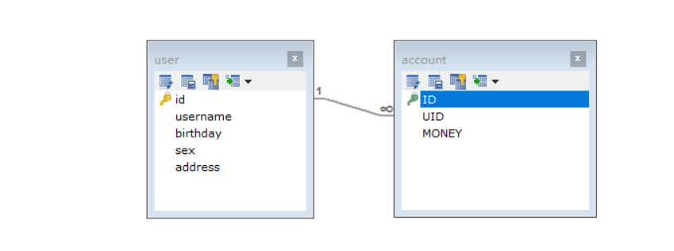

# 数据库多表查询设计

- 一对一：在任意一方设计外键保存另一张表的主键，以维持两表关系。
- 一对多：在多的一方设计外键保存一的一方的主键，以维持两表关系。
- 多对多：建立第三方表，存储两张表主键的对应关系，将多对多拆分为两个一对多。

# 数据库多表查询的几种方式

>  参考：[多表查询](https://blog.csdn.net/Sky_QiaoBa_Sum/article/details/104707419)

- 笛卡尔积查询：`SELECT * FROM dept,emp WHERE emp.dept_id = dept.id;`
- 内连接查询：`SELECT * FROM dept INNER JOIN emp ON dept.id = emp.dept_id ;`
- 外连接查询
  - 左外连接：`SELECT * FROM dept LEFT JOIN emp  ON dept.id = emp.dept_id;`
  - 右外连接：`SELECT * FROM dept RIGHT JOIN emp  ON dept.id = emp.dept_id;`
  - 全外连接：`SELECT * FROM dept LEFT JOIN emp ON dept.id = emp.dept_id  UNION	SELECT * FROM dept RIGHT JOIN emp ON dept.id = emp.dept_id ;`

# 三种多表关系的演示

首先先创建两张表，user和account，在account表中设计外键保存user的主键id。

```sql
DROP TABLE IF EXISTS `user`;

CREATE TABLE `user` (
  `id` int(11) NOT NULL auto_increment,
  `username` varchar(32) NOT NULL COMMENT '用户名称',
  `birthday` datetime default NULL COMMENT '生日',
  `sex` char(1) default NULL COMMENT '性别',
  `address` varchar(256) default NULL COMMENT '地址',
  PRIMARY KEY  (`id`)
) ENGINE=InnoDB DEFAULT CHARSET=utf8;

insert  into `user`(`id`,`username`,`birthday`,`sex`,`address`) values (41,'老王','2018-02-27 17:47:08','男','北京'),(42,'小二王','2018-03-02 15:09:37','女','北京金燕龙'),(43,'小二王','2018-03-04 11:34:34','女','北京金燕龙'),(45,'中王','2018-03-04 12:04:06','男','北京金燕龙'),(46,'老王','2018-03-07 17:37:26','男','北京'),(48,'小马宝莉','2018-03-08 11:44:00','女','北京修正');

DROP TABLE IF EXISTS `account`;

CREATE TABLE `account` (
  `ID` int(11) NOT NULL COMMENT '编号',
  `UID` int(11) default NULL COMMENT '用户编号',
  `MONEY` double default NULL COMMENT '金额',
  PRIMARY KEY  (`ID`),
  KEY `FK_Reference_8` (`UID`),
  CONSTRAINT `FK_Reference_8` FOREIGN KEY (`UID`) REFERENCES `user` (`id`)
) ENGINE=InnoDB DEFAULT CHARSET=utf8;


insert  into `account`(`ID`,`UID`,`MONEY`) values (1,46,1000),(2,45,1000),(3,46,2000);
```



【场景】

- 一个用户可以拥有多个账户，因此，从用户出发查询账户信息，将会是一对多的关系。
- 一个账户只能被一个用户拥有，因此，从账户出发查询关联的用户是一对一的关系。

## 一对一关系

那么就是从账户出发，查询账户对应的用户，账户信息只有三条，因此只能查出三条记录。

```sql
select u.*,a.ID as aid,a.UID,a.MONEY from account a,user u where a.UID = u.id;
```


sql语句已经明了，那么我们在mybatis中如何去编写呢？可以确定的是，我们现在需要一个查询一个账户，这个账户不仅拥有自己的字段信息，而且还需要包含一个用户user的信息，我们可以有以下两种方法去完成：

1. 定义一个实体类AccountUser继承Account，此时它就拥有Account的所有字段，接下来定义在其中定义User字段的信息，这样我们就可以将查询的信息封装到这个AccountUser类中返回。
2. 使用resultMap映射一对一查询的结果，利用association元素封装主表的信息：

```java
public class Account {
    private Integer id;
    private Integer uid;
    private Double money;
    //从表实体应该包含一个主表实体的对象引用
    private User user;
	//省略getter和setter
}
```

```xml
    <!--定义封装account和user的resultmap-->
    <resultMap id="accountUserMap" type="account">
        <!--account对象的封装，需要注意的是，语句中如果起了别名，对应的column需要改变-->
        <id property="id" column="aid"></id>
        <result property="uid" column="uid"></result>
        <result property="money" column="money"></result>
        <!-- 一对一的关系映射,配置封装user，javaType标识封装的对象类型 -->
        <association property="user" column="uid" javaType="user">
            <id property="id" column="id"></id>
            <result column="username" property="username"></result>
            <result column="address" property="address"></result>
            <result column="sex" property="sex"></result>
            <result column="birthday" property="birthday"></result>
        </association>
    </resultMap>
    <!-- 查询所有 -->
    <select id="findAll" resultMap="accountUserMap">
        SELECT u.*,a.id AS aid,a.uid,a.money FROM account a,USER u WHERE u.id = a.uid;
    </select>
```


## 一对多关系

我们现在需要查询所有用户信息以及用户关联的账户信息，可以确定的是，某些用户可能拥有多个账户，某些用户可能没有，此时这种一对多的关系可以采用左外连接查询，查询User表中有而Account表中没有的信息。

```sql
select u.*,a.ID as aid,a.UID,a.MONEY from user u left join account a on a.UID = u.id;
```


如上分析，一对一的关系可以采用resultMap进行结果集的映射，同样的，一对多当然也可以，只是使用的元素不同。

```java
public class User implements Serializable {
    private Integer id;
    private String username;
    private String address;
    private String sex;
    private Date birthday;
    //一对多关系映射,主表实体应该包含从表实体的集合引用
    private List<Account> accounts;
    //省略getter和setter
}
```

```xml
    <!--定义User的resultmap-->
    <resultMap id="userAccountMap" type="user">

        <id property="id" column="id"></id>
        <result property="username" column="username"></result>
        <result property="address" column="address"></result>
        <result property="sex" column="sex"></result>
        <result property="birthday" column="birthday"></result>
        <!--配置user中accounts集合的映射,ofType为集合中对象的类型-->
        <collection property="accounts" ofType="account">
            <id property="id" column="aid" ></id>
            <result property="uid" column="uid" ></result>
            <result property="money" column="money"></result>
        </collection>
    </resultMap>
    <!-- 查询所有 -->
    <select id="findAll" resultMap="userAccountMap" >
        select u.*,a.ID as aid,a.UID,a.MONEY from user u left join account a on a.UID = u.id;
    </select>
```


## 多对多关系

为了模拟多对多的关系，我们需要三张表，一张是User表，可以沿用上面的User表，除此之外，我们还需要创建一张角色表和一张第三方表，存储两张主表的id。

```sql
DROP TABLE IF EXISTS `role`;
CREATE TABLE `role` (
  `ID` int(11) NOT NULL COMMENT '编号',
  `ROLE_NAME` varchar(30) default NULL COMMENT '角色名称',
  `ROLE_DESC` varchar(60) default NULL COMMENT '角色描述',
  PRIMARY KEY  (`ID`)
) ENGINE=InnoDB DEFAULT CHARSET=utf8;

insert  into `role`(`ID`,`ROLE_NAME`,`ROLE_DESC`) values (1,'院长','管理整个学院'),(2,'总裁','管理整个公司'),(3,'校长','管理整个学校');

DROP TABLE IF EXISTS `user_role`;
CREATE TABLE `user_role` (
  `UID` int(11) NOT NULL COMMENT '用户编号',
  `RID` int(11) NOT NULL COMMENT '角色编号',
  PRIMARY KEY  (`UID`,`RID`),
  KEY `FK_Reference_10` (`RID`),
  CONSTRAINT `FK_Reference_10` FOREIGN KEY (`RID`) REFERENCES `role` (`ID`),
  CONSTRAINT `FK_Reference_9` FOREIGN KEY (`UID`) REFERENCES `user` (`id`)
) ENGINE=InnoDB DEFAULT CHARSET=utf8;

insert  into `user_role`(`UID`,`RID`) values (41,1),(45,1),(41,2);
```


ok，三表建立之后，我们可以知道多对多的关系出现在：一个用户可以拥有多个角色，它既可以是校长，也可以是院长，并且一个角色可以被多个用户拥有，用户A和B都可以是院长。

其实可以直接看成是两个一对多的关系：

【从User出发查询Role】


```java
public class User implements Serializable {

    private Integer id;
    private String username;
    private String address;
    private String sex;
    private Date birthday;

    //多对多的关系映射,一个用户可以拥有多个角色
    private List<Role> roles;
}
```

```xml
    <!--定义User的resultmap-->
    <resultMap id="userMap" type="user">

        <id property="id" column="id"></id>
        <result property="username" column="username"></result>
        <result property="address" column="address"></result>
        <result property="sex" column="sex"></result>
        <result property="birthday" column="birthday"></result>
        <!--配置角色集合的映射-->
        <collection property="roles" ofType="role">
            <id property="roleId" column="rid"></id>
            <result property="roleName" column="role_name"></result>
            <result property="roleDesc" column="role_desc"></result>
        </collection>
    </resultMap>
    <!-- 查询所有 -->
    <select id="findAll" resultMap="userMap">
        select u.*,r.id as rid,r.role_name,r.role_desc from user u
             left outer join user_role ur  on u.id = ur.uid
             left outer join role r on r.id = ur.rid
    </select>
```


【从Role出发查找User】


```java
public class Role implements Serializable {

    private Integer roleId;
    private String roleName;
    private String roleDesc;

    //多对多的关系映射,一个角色赋予多个用户
    private List<User> users;
}
```

```xml
    <!--定义role表的resultMap-->
    <resultMap id="roleMap" type="role">
        <id property="roleId" column="rid"></id>
        <result property="roleName" column="role_name"></result>
        <result property="roleDesc" column="role_desc"></result>
        <collection property="users" ofType="user">
            <id property="id" column="id"></id>
            <result property="username" column="username"></result>
            <result property="address" column="address"></result>
            <result property="sex" column="sex"></result>
            <result property="birthday" column="birthday"></result>
        </collection>
    </resultMap>
    <!--查询所有-->
    <select id="findAll" resultMap="roleMap">
        SELECT u.*,r.id AS rid,r.ROLE_NAME,r.ROLE_DESC FROM role r
            LEFT OUTER JOIN user_role ur ON r.id = ur.rid
            LEFT OUTER JOIN USER u ON u.id = ur.uid
    </select>
```

