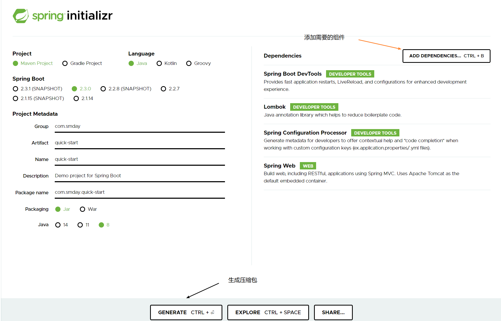
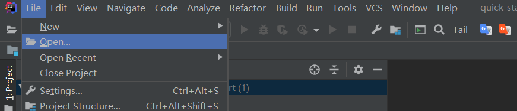
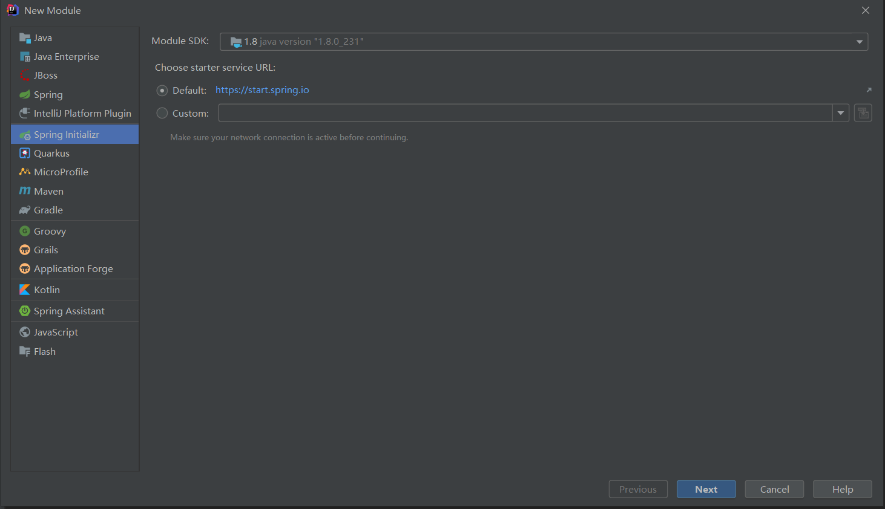
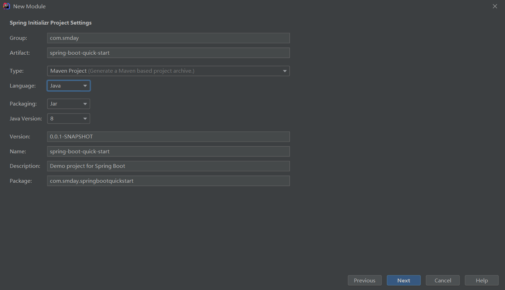
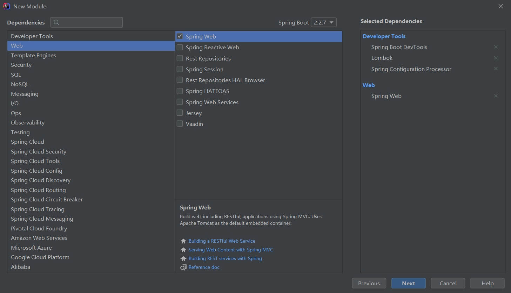
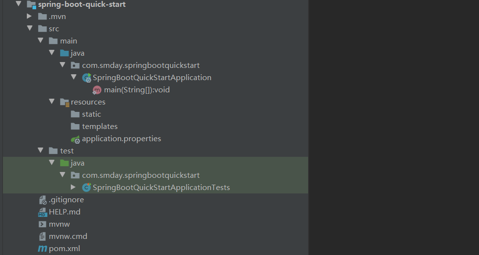
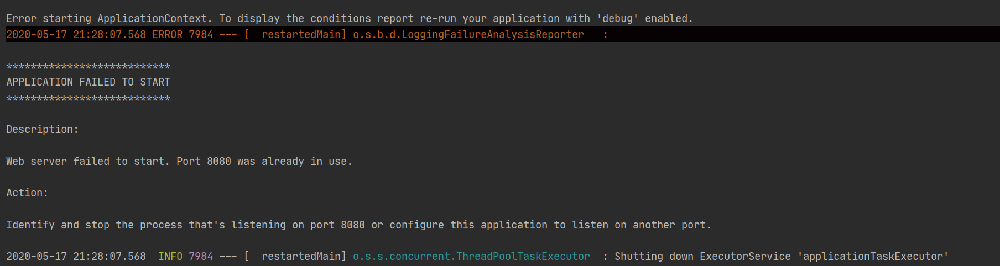
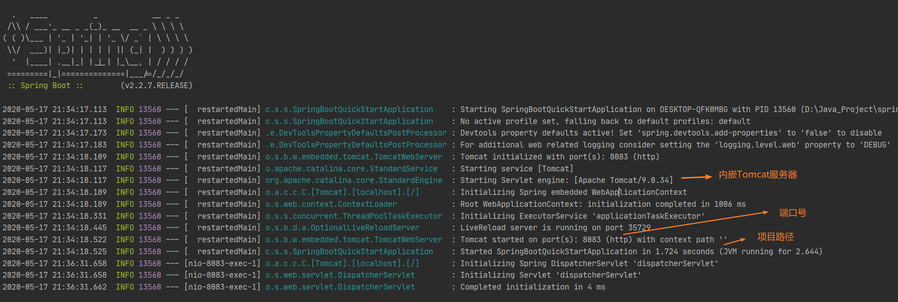
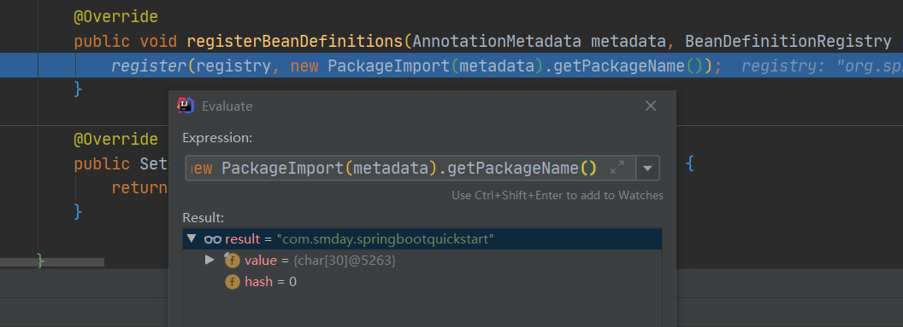

[toc]

# 一、快速入门

## 1. 创建项目

想要快速建立一个SpringBoot项目，有很多种方法，本文主要总结两种比较常用的方法，突出一个快字。

### 1. spring initializr创建

进入[https://start.spring.io/](https://start.spring.io/)网站，页面很清新，很绿，很舒服。

- 左边选择一些语言，版本，项目构建等信息。
- 右边可以选择添加需要的组件。
- 选择完成之后，可以点击GENERATE，下载压缩包。



解压下载下来的解压包，用IDEA打开即可。



### 2. IntelliJ IDEA创建

创建Project或者Module，选在Spring Initializr创建项目，其实也就是IDEA对官方工具的集成。



填写需要的信息，点击next。



选择添加需要的组件，点击next。



接着next，配置项目路径，最终就可以看到完整的项目结构了。



项目结构如下：

- `src/main/java`：XxxApplication，SpringBoot的主入口。
- `src/main/resources`：
  - application.properties：SpringBoot全局配置文件。
  - static目录：存放所有的静态资源：js、css、images。
  - templates：存放模板页面，可以使用模板引擎渲染。
- `src/test/java`：XxxApplicationTests，SpringBoot的测试入口。

## 2、编写第一个测试案例

```java
@RestController
public class HelloController {

    @GetMapping("/hello")
    public String hello(){
        return "this is my spring-boot-quick-start...";
    }
}
```

启动Application入口程序，SpringBoot就成功运行，但是可能会出现一点问题，比如默认端口号被占用。



Web服务器默认在8080端口运行，但控制台提示该端口已经被占用了，此时我们只需要在`application.properties`的配置文件中修改一下端口号即可。

```properties
server.port=8083
```



在地址栏输入`http://localhost:8083/hello`就可以看到效果了，

# 二、pom.xml依赖

本项目基于maven工具构建，需要添加的依赖通过

```xml
<?xml version="1.0" encoding="UTF-8"?>
<project xmlns="http://maven.apache.org/POM/4.0.0" xmlns:xsi="http://www.w3.org/2001/XMLSchema-instance"
         xsi:schemaLocation="http://maven.apache.org/POM/4.0.0 https://maven.apache.org/xsd/maven-4.0.0.xsd">
    <modelVersion>4.0.0</modelVersion>
    <!--继承spring-boot-starter-parent-->
    <parent>
        <groupId>org.springframework.boot</groupId>
        <artifactId>spring-boot-starter-parent</artifactId>
        <version>2.2.7.RELEASE</version>
        <relativePath/> <!-- lookup parent from repository -->
    </parent>
    <groupId>com.smday</groupId>
    <artifactId>spring-boot-quick-start</artifactId>
    <version>0.0.1-SNAPSHOT</version>
    <name>spring-boot-quick-start</name>
    <description>Demo project for Spring Boot</description>

    <properties>
        <java.version>1.8</java.version>
    </properties>

    <dependencies>
        <!--web-->
        <dependency>
            <groupId>org.springframework.boot</groupId>
            <artifactId>spring-boot-starter-web</artifactId>
        </dependency>
        <!--devtools-->
        <dependency>
            <groupId>org.springframework.boot</groupId>
            <artifactId>spring-boot-devtools</artifactId>
            <scope>runtime</scope>
            <optional>true</optional>
        </dependency>
        <!--configuration-processor-->
        <dependency>
            <groupId>org.springframework.boot</groupId>
            <artifactId>spring-boot-configuration-processor</artifactId>
            <optional>true</optional>
        </dependency>
        <!--lombok-->
        <dependency>
            <groupId>org.projectlombok</groupId>
            <artifactId>lombok</artifactId>
            <optional>true</optional>
        </dependency>
        <!--test-->
        <dependency>
            <groupId>org.springframework.boot</groupId>
            <artifactId>spring-boot-starter-test</artifactId>
            <scope>test</scope>
            <exclusions>
                <exclusion>
                    <groupId>org.junit.vintage</groupId>
                    <artifactId>junit-vintage-engine</artifactId>
                </exclusion>
            </exclusions>
        </dependency>
    </dependencies>

    <build>
        <plugins>
            <!--项目构建插件-->
            <plugin>
                <groupId>org.springframework.boot</groupId>
                <artifactId>spring-boot-maven-plugin</artifactId>
            </plugin>
        </plugins>
    </build>

</project>

```

- 元数据：如groupId、artifactId、version、name、description等信息。

- parent：`spring-boot-starter-parent`的究极父项目是`spring-boot-dependencies`，定义了各种依赖的版本。

- dependencies：需要的组件依赖，不需要写依赖的版本，在`spring-boot-dependencies`已经定义。SpringBoot将需要的功能场景进行抽取，形成starters启动器，如我们需要web相关功能，就可以引入`spring-boot-starter-web`。

- build：项目构建配置，这里配置了项目构建的插件，可以通过`spring-boot-maven-plugin`快速将SpringBoot项目打成jar包。

  

# 三、主程序类分析

```java
@SpringBootApplication
public class SpringBootQuickStartApplication {

    public static void main(String[] args) {
        //启动SpringBoot应用
        SpringApplication.run(SpringBootQuickStartApplication.class, args);
    }
}
```

## @SpringBootApplication

标识SpringBoot应用的主程序类（主配置类），该类中main方法用以启动SpringBoot应用。

```java
@Target(ElementType.TYPE)
@Retention(RetentionPolicy.RUNTIME)
@Documented
@Inherited
@SpringBootConfiguration
@EnableAutoConfiguration
@ComponentScan(excludeFilters = { @Filter(type = FilterType.CUSTOM, classes = TypeExcludeFilter.class),
		@Filter(type = FilterType.CUSTOM, classes = AutoConfigurationExcludeFilter.class) })
public @interface SpringBootApplication {

	@AliasFor(annotation = EnableAutoConfiguration.class)
	Class<?>[] exclude() default {};


	@AliasFor(annotation = EnableAutoConfiguration.class)
	String[] excludeName() default {};


	@AliasFor(annotation = ComponentScan.class, attribute = "basePackages")
	String[] scanBasePackages() default {};


	@AliasFor(annotation = ComponentScan.class, attribute = "basePackageClasses")
	Class<?>[] scanBasePackageClasses() default {};

	@AliasFor(annotation = Configuration.class)
	boolean proxyBeanMethods() default true;

}
```

## @SpringBootConfiguration

见名知义，用该注解表主的类是SpringBoot的配置类，因为底层用了@Configuration注释，再深究，其实配置类也是容器中的组件之一，底层用了@Component注解。

```java
@Target(ElementType.TYPE)
@Retention(RetentionPolicy.RUNTIME)
@Documented
@Configuration
public @interface SpringBootConfiguration {

	@AliasFor(annotation = Configuration.class)
	boolean proxyBeanMethods() default true;

}
```

## @EnableAutoConfiguration

开启SpringBoot自动配置的功能。

```java
@Target(ElementType.TYPE)
@Retention(RetentionPolicy.RUNTIME)
@Documented
@Inherited
//自动配置包
@AutoConfigurationPackage
//导入组件选择器
@Import(AutoConfigurationImportSelector.class)
public @interface EnableAutoConfiguration {

	String ENABLED_OVERRIDE_PROPERTY = "spring.boot.enableautoconfiguration";

	Class<?>[] exclude() default {};

	String[] excludeName() default {};

}
```

## @AutoConfigurationPackage

即自动配置包功能，底层其实是`@Import(AutoConfigurationPackages.Registrar.class)`，给容器中引入一个组件，该组件由AutoConfigurationPackages的静态内部类Registrar定义注册。

```java
@Import(AutoConfigurationPackages.Registrar.class)
public @interface AutoConfigurationPackage {

}
```

具体注册信息的代码如下：

```java
@Override
public void registerBeanDefinitions(AnnotationMetadata metadata, BeanDefinitionRegistry registry) {
    register(registry, new PackageImport(metadata).getPackageName());
}
```



我们通过debug分析，发现其实就是将@SpringBootApplication标注的类所在包及下面所有子包里的所有组件扫描到Spring容器的过程，那么我们就可以知道，如果我们想让Spring容器管理我们的组件，我们需要注意主配置类存在的位置。

