[toc]

# RabbitMQ的相关概念

>  AMPQ：Advanced Message Queue Protocol，RabbitMQ是erlang开发的AMPQ的实现。

**Message**：消息，不具名，由消息头（由路由键routing-key，优先权priority，持久性存储delivery-mode等可选属性构成）和消息体（不透明）组成。

**Publisher**：消息的生产者，一个**向交换器发布消息**的客户端应用程序。

**Exchange**：交换器，**接收生产者发送的消息并将这些消息路由给服务器中的队列**。有direct，fanout，topic和headers四种类型。

**Queue**：消息队列，用以**保存信息直到发送给消费者**。它是消息的容器，也是消息的重点。**一个消息可投入一个或多个队列**。

**Binding**：绑定，用于**消息队列和交换器之间的关联**。一个绑定就是基于路由键将交换器和消息队列连接起来的路由规则，交换器可以看成是一个由绑定构成的路由表。

**Connection**：网络连接，如一个TCP连接。

**Channel**：信道，多路复用连接中的一条独立的双向数据流通道，引入信道概念，以复用一条TCP连接。

**Consumer**：消息的**消费者**，表示一个**从消息队列中取得消息**的客户端应用程序。

**Virtual Host**：虚拟主机，表示一批交换器、消息队列和相关对象。虚拟主机是共享相同的身份认证加密环境的独立服务器域，**每个vhost本质上就是一个mini版的RabbitMQ服务器**，拥有自己的队列、交换器、绑定和权限机制。vhost必须在连接时指定，RabbitMQ默认的vhost是`/`。

**Broker**：表示消息队列服务器实体。


# RabbitMQ的几种模式

[https://www.rabbitmq.com/tutorials/tutorial-three-python.html](https://www.rabbitmq.com/tutorials/tutorial-three-python.html)

- **简单模式**：一对一，即一个生产者对应一个消费者。

  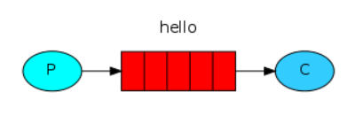

- **Work队列**：一个生产者对应多个消费者，但是只能有一个消费者获得消息。

  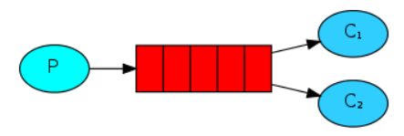

- **发布/订阅Publish/Subscribe**：发布者将消息发送到交换器，交换器绑定多个队列，监听这些队列的订阅者都能收到消息，也就是我们后面要说的fanout。

  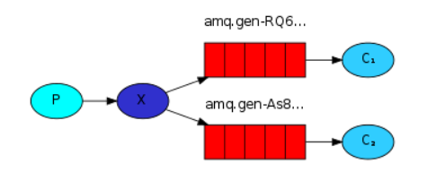

- **路由Routing**：交换器和队列通过路由键绑定，生产者将消息发送到交换器时指定路由键，只会发送到对应的队列，监听该队列的消费者收到信息。

  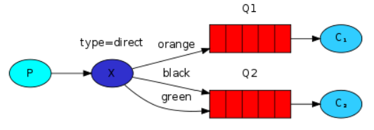

- **主题Topics**：和Routing路由模式一样，都是匹配路由键，只不过Topic是通过通配符匹配。`#`匹配0个或多个单词，`*`匹配一个单词。

  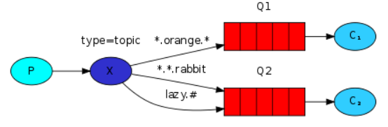

# Exchange的四种类型

> 除了headers之外，其他和路由模式、发布订阅模式和通配符模式一一对应。

**direct**：**完全匹配、单播模式**。消息中的**路由键（routing key）如果和 Binding 中的 binding key 一致**， 交换器就将消息发到对应的队列中。


**fanout**：每个发到 fanout 类型交换器的消息都会分到所有绑定的队列上去。**fanout 交换器不处理路由键，只是简单的将队列绑定到交换器上**，每个发送到交换器的消息都会被转发到与该交换器绑定的所有队列上。很像子网广播，每台子网内的主机都获得了一份复制的消息。fanout 类型转发消息是最快的。


**topic**：**topic 交换器通过模式匹配分配消息的路由键属性**，将路由键和某个模式进行匹配，此时队列需要绑定到一个模式上。它将路由键和绑定键的字符串切分成单词，这些单词之间用点隔开。它同样也会识别两个通配符：符号`#`和符号`*`。`#`匹配0个或多个单词，`*`匹配一个单词。


**headers**：匹配AMPQ消息的header而不是路由键，headers交换器和direct交换器完全一致，但性能差很多，几乎不用。

# Linux系统上Rabbitmq的安装

```bash
docker pull rabbitmq:3-management # management带web界面管理
docker run -d --name myrabbit -p 5672:5672 -p 15672:15672 cc86ffa2f398 #启动

systemctl status firewalld #查看防火墙的状态【(running)意思是打开，我们需要设置开放的端口】
firewall-cmd --list-ports #查看防火墙开放的端口
firewall-cmd --zone=public --add-port=15672/tcp --permanent # 开放15672
firewall-cmd --zone=public --add-port=5672/tcp --permanent # 开放5672
firewall-cmd --reload # 使修改生效

```

 此时就可以通过`http://192.168.213.129:15672/`访问rabbitmq管理界面，账号密码默认都是guest。如果是在云服务器上部署，需要设置15672和5672安全组。

# RabbitMQ的Web界面操作

**RabbitMQ的web管理界面**

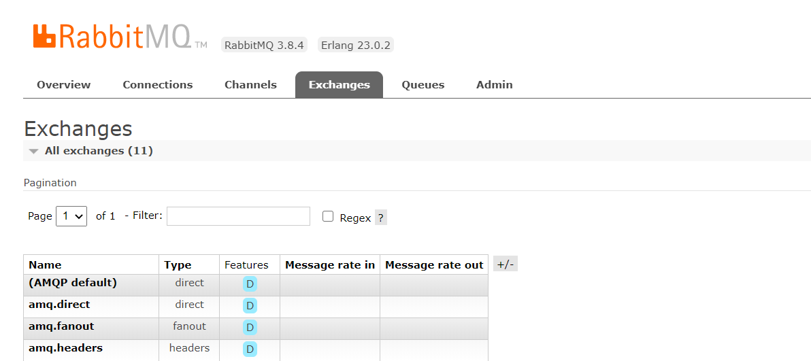

**创建帐号并设置其角色为管理员：smday**

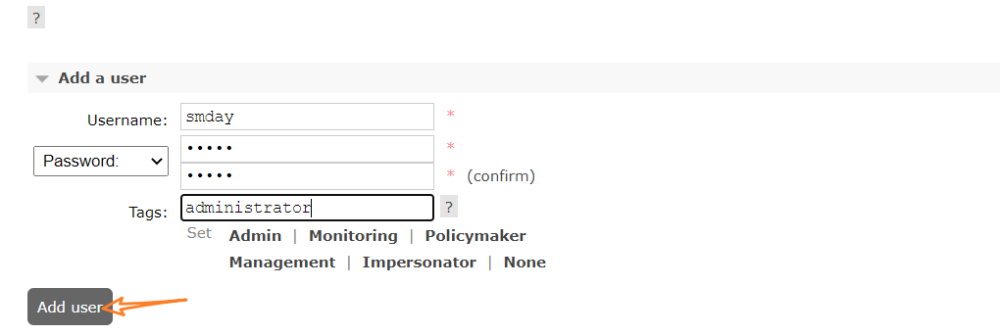

**设置Virtual Hosts**

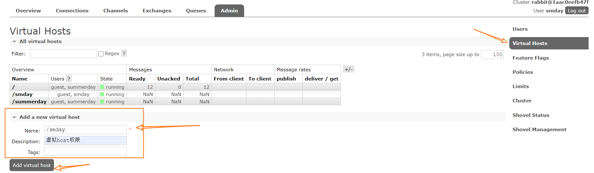


**给创建的用户设置虚拟Host权限**

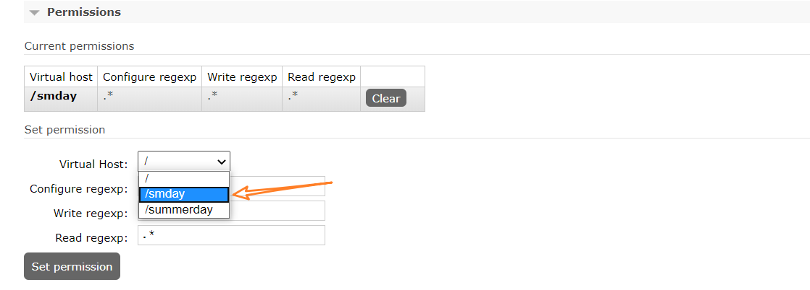

**Exchange的添加操作及参数介绍**

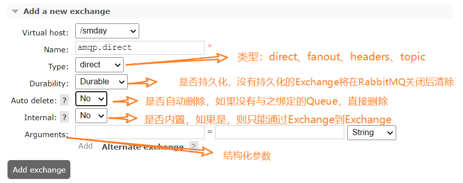

结构化参数其实就是一个Map，key是指定字符串，比如这里的Alternate-exchange，如果exchange1指定了`Alternate-exchange`的值为exchange2，那么如果消息无法匹配exchange1绑定的queue1，它会尝试通过exchange2路由到exchange2绑定的queue2。

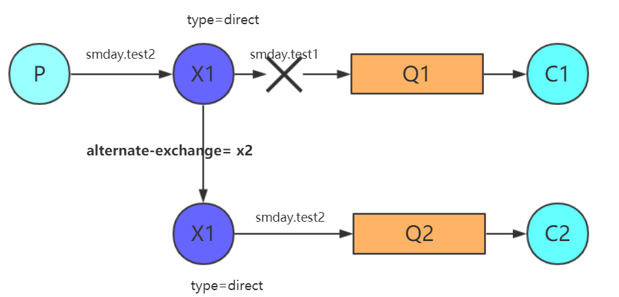

**Queue的添加操作及参数介绍**

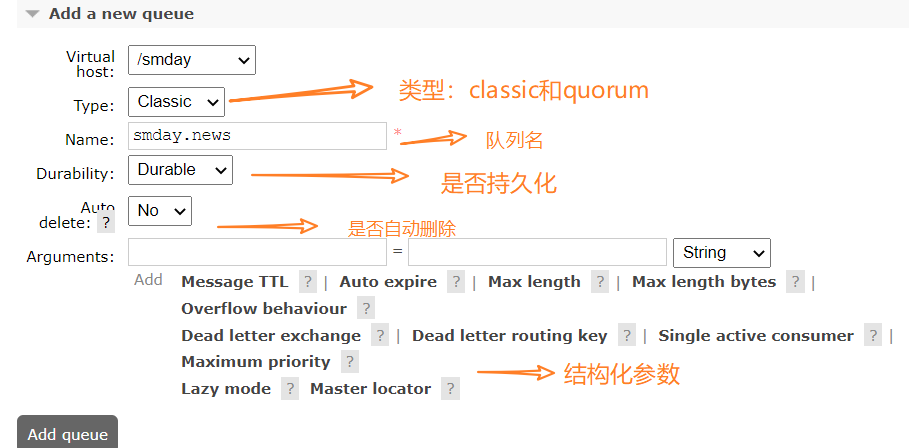

大致差不多，可以看看它的一些结构化参数：

[https://www.cnblogs.com/LiangSW/p/6224333.html](https://www.cnblogs.com/LiangSW/p/6224333.html)

| 参数名key                 | 值value类型 | 解释                                                         |
| ------------------------- | ----------- | ------------------------------------------------------------ |
| x-message-ttl             | Number      | Time-to-Live指消息在队列中存活的最长的时间                   |
| x-expires                 | Number      | 指定毫秒内，若队列未被使用则自定删除                         |
| x-max-length              | Number      | 队列的消息最大条数                                           |
| x-max-length-bytes        | Number      | 消息的最大占用大小                                           |
| x-dead-letter-exchange    | String      | 死信发生，重新发送该消息到指定交换器                         |
| x-dead-letter-routing-key | String      | 死信发生，重新指定路由键                                     |
| x-max-priority            | Number      | 设置的数字为最大优先级数，如果没设置则不支持优先级           |
| x-queue-mode              | String      | 默认为default，可设为lazy，将内容尽早移入磁盘                |
| x-single-active-consumer  | Boolean     | 如果设置，确保每次只有一个使用者从队列中消费，若其被取消或死亡时故障转移到另一个已注册的使用者。 |
| x-overflow                | String      | 设置队列溢出行为：drop-head`, `reject-publish` or `reject-publish-dlx |
| x-queue-master-locator    | String      | 将队列设置为主位置模式，确定在节点集群上声明队列主位置时所使用的规则。 |

# 快速体验

**导入消息队列相关依赖**

```xml
<!--消息队列相关依赖-->
<dependency>
    <groupId>org.springframework.boot</groupId>
    <artifactId>spring-boot-starter-amqp</artifactId>
</dependency>
```

**配置yml**

```yml
spring:
  rabbitmq:
    host: 121.199.16.31 # rabbitmq的连接地址
    virtual-host: /smday # rabbitmq的虚拟host
    username: xxx # rabbitmq的用户名
    password: xxx # rabbitmq的密码
    publisher-confirms: true #如果对异步消息需要回调必须设置为true
```

**进行测试**

```java
@SpringBootTest
class SpringbootAmqpApplicationTests {

    @Autowired
    RabbitTemplate rabbitTemplate;
    @Test
    void contextLoads() {

        Map<String,Object> map = new HashMap<>();
        map.put("msg","hello");
        map.put("data", Arrays.asList("1","2"));
        //对象被默认序列化后发送出去
        rabbitTemplate.convertAndSend("exchange.direct","summerday.news",map);
    }

    @Test
    public void receive(){
        //接收消息之后,队列中消失
        Object o = rabbitTemplate.receiveAndConvert("summerday.news");
        System.out.println(o.getClass());
        System.out.println(o);
    }
    @Test
    public void fanout(){
      	rabbitTemplate.convertAndSend("exchange.fanout","","xxx");
    }

}
```

**自定义messageconverter**

```java
@Configuration
public class MyAMPQConfig {

    @Bean
    public MessageConverter messageConverter(){
        return new Jackson2JsonMessageConverter();
    }
}
```

**消费者监听事件，收到队列中的消息**

```java
@Service
public class BookService {

    @RabbitListener(queues = "atguigu.news")
    public void receive(Book book){
        System.out.println("收到消息: "+book);
    }
    @RabbitListener(queues = "summerday.news")
    public void receive01(Message message){
        System.out.println(message.getBody());
        System.out.println(message.getMessageProperties());
    }
}
```

**使用Amqpadmin创建**

```java
@Autowired
AmqpAdmin amqpAdmin;

@Test
public void createExchange(){
    amqpAdmin.declareExchange(new DirectExchange("amqpadmin.exchange"));
    System.out.println("创建完成!");
}
@Test
public void createQueue(){
    amqpAdmin.declareQueue(new Queue("amqpadmin.queue",true));
    System.out.println("创建完成!");
}
@Test
public void bind(){
    amqpAdmin.declareBinding(new Binding("amqpadmin.queue", Binding.DestinationType.QUEUE,"amqpadmin.exchange","amqp.haha", null));
}
```


# 参考链接

[https://www.cnblogs.com/ysocean/p/9251884.html](https://www.cnblogs.com/ysocean/p/9251884.html)

[https://www.rabbitmq.com/getstarted.html](https://www.rabbitmq.com/getstarted.html)

[http://www.macrozheng.com/#/architect/mall_arch_09](http://www.macrozheng.com/#/architect/mall_arch_09)

[https://blog.csdn.net/dh554112075/article/details/90182453](https://blog.csdn.net/dh554112075/article/details/90182453)