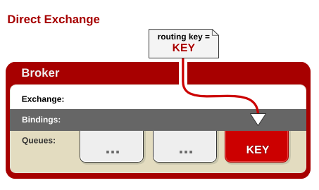

JMS：Java Message Service

AMPQ：Advanced Message Queue Protocol

# RabbitMQ

erlang开发的AMPQ的实现。

**Message**：消息，不具名，由消息头（由路由键routing-key，优先权priority，持久性存储delivery-mode等可选属性构成）和消息体（不透明）组成。

**Publisher**：消息的生产者，一个向交换器发布消息的客户端应用程序。

**Exchange**：交换器，接收生产者发送的消息并将这些消息路由给服务器中的队列。有direct，fanout，topic和headers四种类型。

**Queue**：消息队列，用以保存信息直到发送给消费者。它是消息的容器，也是消息的重点。一个消息可投入一个或多个队列。

**Binding**：绑定，用于消息队列和交换器之间的关联。一个绑定就是基于路由键将交换器和消息队列连接起来的路由规则，交换器可以看成是一个由绑定构成的路由表。

**Connection**：网络连接，如一个TCP连接。

**Channel**：信道，多路复用连接中的一条独立的双向数据流通道，引入信道概念，以复用一条TCP连接。

**Consumer**：消息的消费者，表示一个从消息队列中取得消息的客户端应用程序。

**Virtual Host**：虚拟主机，表示一批交换器、消息队列和相关对象。虚拟主机是共享相同的身份认证加密环境的独立服务器域，每个vhost本质上就是一个mini版的RabbitMQ服务器，拥有自己的队列、交换器、绑定和权限机制。vhost必须在连接时指定，RabbitMQ默认的vhost是`/`。

**Broker**：表示消息队列服务器实体。


# Exchange的类型

**direct**：**完全匹配、单播模式**。消息中的路由键（routing key）如果和 Binding 中的 binding key 一致， 交换器就将消息发到对应的队列中。路由键与队列名完全匹配，如果一个队列绑定到交换机要求路由键为“dog”，则只转发 routing key 标记为“dog”的消息，不会转发“dog.puppy”，也不会转发“dog.guard”等等。



**fanout**：每个发到 fanout 类型交换器的消息都会分到所有绑定的队列上去。**fanout 交换器不处理路由键，只是简单的将队列绑定到交换器上**，每个发送到交换器的消息都会被转发到与该交换器绑定的所有队列上。很像子网广播，每台子网内的主机都获得了一份复制的消息。fanout 类型转发消息是最快的。


**topic**：**topic 交换器通过模式匹配分配消息的路由键属性**，将路由键和某个模式进行匹配，此时队列需要绑定到一个模式上。它将路由键和绑定键的字符串切分成单词，这些单词之间用点隔开。它同样也会识别两个通配符：符号`#`和符号`*`。`#`匹配0个或多个单词，`*`匹配一个单词。


**headers**：匹配AMPQ消息的header而不是路由键，headers交换器和direct交换器完全一致，但性能差很多，几乎不用。

# Linux系统上Rabbitmq的安装

```bash
docker pull rabbitmq:3-management # management带web界面管理
docker run -d --name myrabbit -p 5672:5672 -p 15672:15672 cc86ffa2f398 #启动

systemctl status firewalld #查看防火墙的状态【(running)意思是打开，我们需要设置开放的端口】
firewall-cmd --list-ports #查看防火墙开放的端口
firewall-cmd --zone=public --add-port=15672/tcp --permanent # 开放15672
firewall-cmd --zone=public --add-port=5672/tcp --permanent # 开放5672
firewall-cmd --reload # 使修改生效

```

 此时就可以通过`http://192.168.213.129:15672/`访问rabbitmq管理界面。

如果是在云服务器上部署，需要设置15672和5672安全组。

# 快速体验

配置yml

```yml
spring:
  rabbitmq:
    host: 121.199.16.31
    username: guest
    password: guest
```

```java
@SpringBootTest
class SpringbootAmqpApplicationTests {

    @Autowired
    RabbitTemplate rabbitTemplate;
    @Test
    void contextLoads() {

        Map<String,Object> map = new HashMap<>();
        map.put("msg","hello");
        map.put("data", Arrays.asList("1","2"));
        //对象被默认序列化后发送出去
        rabbitTemplate.convertAndSend("exchange.direct","summerday.news",map);
    }

    @Test
    public void receive(){
        //接收消息之后,队列中消失
        Object o = rabbitTemplate.receiveAndConvert("summerday.news");
        System.out.println(o.getClass());
        System.out.println(o);
    }
    @Test
    public void fanout(){
      	rabbitTemplate.convertAndSend("exchange.fanout","","xxx");
    }

}
```

自定义messageconverter

```java
@Configuration
public class MyAMPQConfig {

    @Bean
    public MessageConverter messageConverter(){
        return new Jackson2JsonMessageConverter();
    }
}
```

监听事件

```java
@Service
public class BookService {


    @RabbitListener(queues = "atguigu.news")
    public void receive(Book book){
        System.out.println("收到消息: "+book);
    }
    @RabbitListener(queues = "summerday.news")
    public void receive01(Message message){
        System.out.println(message.getBody());
        System.out.println(message.getMessageProperties());
    }
}
```

使用amqpadmin创建

```java
@Autowired
AmqpAdmin amqpAdmin;

@Test
public void createExchange(){
    amqpAdmin.declareExchange(new DirectExchange("amqpadmin.exchange"));
    System.out.println("创建完成!");
}
@Test
public void createQueue(){
    amqpAdmin.declareQueue(new Queue("amqpadmin.queue",true));
    System.out.println("创建完成!");
}
@Test
public void bind(){
    amqpAdmin.declareBinding(new Binding("amqpadmin.queue", Binding.DestinationType.QUEUE,"amqpadmin.exchange","amqp.haha", null));
}
```


# rabbitmq-plugins: command not found

遇到这种情况，可以通过进入命令行，再执行相应的指令：

```bash
docker exec -it 1aac0eefb47f /bin/bash
```

