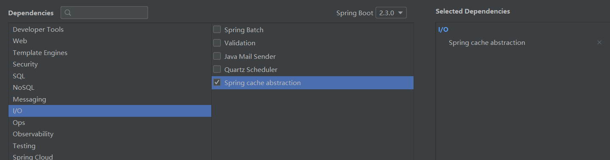
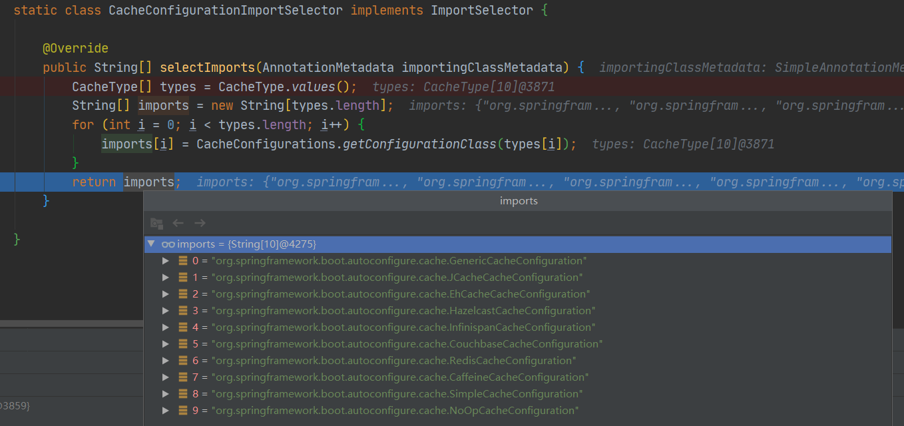

# 快速体验整合缓存

Springboot2.x的cache组件在I/O中，为Spring cache abstraction



主要的依赖组件依赖如下：

```xml
    <dependencies>
        <!-- 整合cache -->
        <dependency>
            <groupId>org.springframework.boot</groupId>
            <artifactId>spring-boot-starter-cache</artifactId>
        </dependency>
        <!-- 整合mybatis -->
        <dependency>
            <groupId>org.mybatis.spring.boot</groupId>
            <artifactId>mybatis-spring-boot-starter</artifactId>
            <version>2.1.2</version>
        </dependency>
        <!-- mysql驱动 -->
        <dependency>
            <groupId>mysql</groupId>
            <artifactId>mysql-connector-java</artifactId>
            <scope>runtime</scope>
        </dependency>
        <!-- 整合web -->
        <dependency>
            <groupId>org.springframework.boot</groupId>
            <artifactId>spring-boot-starter-web</artifactId>
        </dependency>
</dependencies>
```

编辑application.yml配置

```yml
# 配置数据源
spring:
  datasource:
    url: jdbc:mysql://localhost:3306/spring_cache?serverTimezone=UTC
    username: root
    password: 123456
    driver-class-name: com.mysql.cj.jdbc.Driver
mybatis:
  configuration:
    map-underscore-to-camel-case: true
server:
  port: 8088
```

定义一个与数据库交互的mapper

```java
@Mapper
public interface EmployeeMapper {

    @Select("select * from employee where id = #{id}")
    Employee getEmpById(Integer id);

    @Update("update employee set lastName=#{lastName},email=#{email},gender=#{gender},d_id=#{dId} where id=#{id}")
    void updateEmp(Employee employee);

    @Delete("delete from employee where id = #{id}")
    void deleteEmpById(Integer id);

    @Insert("insert into employee(lastName,email,gender,d_id) values(#{lastName},#{email},#{gender},#{dId}")
    void insertEmp(Employee employee);
}
```

在主配置类上使用`@MapperScan`注解扫描mapper接口所在的包，使用`@EnableCaching`开启基于注解的缓存。

```java
@MapperScan("com.smday.cache.mapper")
@SpringBootApplication
@EnableCaching
public class Springboot01CacheApplication {
    public static void main(String[] args) {
        SpringApplication.run(Springboot01CacheApplication.class, args);
    }
}
```

在需要缓存的方法上加上适当的注解，如`@Cacheable`。

```java
@Service
public class EmployeeService {

    @Autowired
    EmployeeMapper employeeMapper;

    /**
     * 将方法的运行结果进行缓存,以后再需要相同的数据,直接从缓存中获取,不用调用方法
     */
    @Cacheable(cacheNames = "emp",condition = "#id>0")
    public Employee getEmp(Integer id){
        System.out.println("查询"+id+"号员工!");
        return employeeMapper.getEmpById(id);
    }
}
```


# 源码解读



