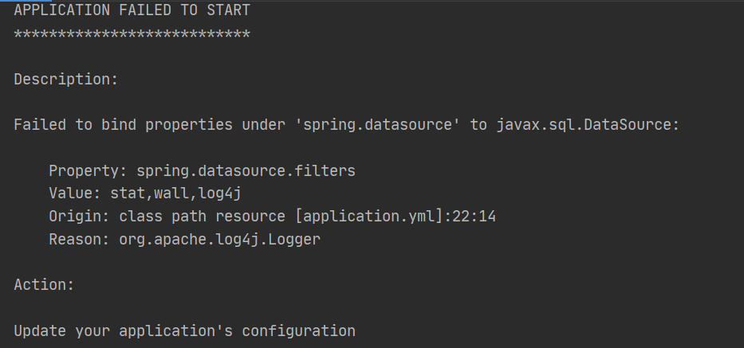
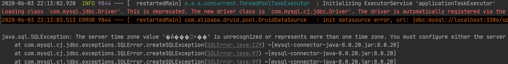

[toc]

# 一、Failed to bind properties under 'spring.datasource' to javax.sql.DataSource

看的是尚硅谷的视频，springboot整合druid数据源时产生的问题：



参考：[https://blog.csdn.net/xingkongtianma01/article/details/81624313](https://blog.csdn.net/xingkongtianma01/article/details/81624313)

导入log4j的依赖或者删除配置文件中的log4j即可。

# 二、连接数据库出现The server time zone value '�й���׼ʱ��' is unrecogni等问题的解决方案



这个问题和mysql驱动版本太高有关，按照如下修改连接配置即可：

```java
    driver-class-name: com.mysql.cj.jdbc.Driver 
    url: jdbc:mysql://localhost:3306/springboot?serverTimezone=UTC
```

# 三、SpringBoot2.x版本自动建表

参考：[https://blog.csdn.net/weixin_41334434/article/details/90380540](https://blog.csdn.net/weixin_41334434/article/details/90380540)

- 指定脚本路径：`classpath:sql/department.sql`
- `initialization-mode: always`

```yml
spring:
  datasource:
    #   数据源基本配置
    username: root
    password: 123456
    driver-class-name: com.mysql.cj.jdbc.Driver
    url: jdbc:mysql://localhost:3306/springboot?serverTimezone=UTC
    type: com.alibaba.druid.pool.DruidDataSource
    #   数据源其他配置
    initialSize: 5
    minIdle: 5
    maxActive: 20
    maxWait: 60000
    timeBetweenEvictionRunsMillis: 60000
    minEvictableIdleTimeMillis: 300000
    validationQuery: SELECT 1 FROM DUAL
    testWhileIdle: true
    testOnBorrow: false
    testOnReturn: false
    poolPreparedStatements: true
    #   配置监控统计拦截的filters，去掉后监控界面sql无法统计，'wall'用于防火墙
    filters: stat,wall,log4j
    maxPoolPreparedStatementPerConnectionSize: 20
    useGlobalDataSourceStat: true
    connectionProperties: druid.stat.mergeSql=true;druid.stat.slowSqlMillis=500
    schema:
      - classpath:sql/department.sql
      - classpath:sql/employee.sql
    initialization-mode: always
```

# 四、Springboot与Mybatis整合相关配置问题（以驼峰命名为例）

参考：[https://www.jianshu.com/p/1507a47f43ac](https://www.jianshu.com/p/1507a47f43ac)

【配置properties或yml】

```yml
#application.yml
mybatis:
  configuration:
    map-underscore-to-camel-case: true
```

【配置Customizer】

```java
@org.springframework.context.annotation.Configuration
public class MyBatisConfig {

    @Bean
    public ConfigurationCustomizer configurationCustomizer(){
        return new ConfigurationCustomizer() {
            @Override
            public void customize(Configuration configuration) {
                configuration.setMapUnderscoreToCamelCase(true);
            }
        };
    }
}
```

