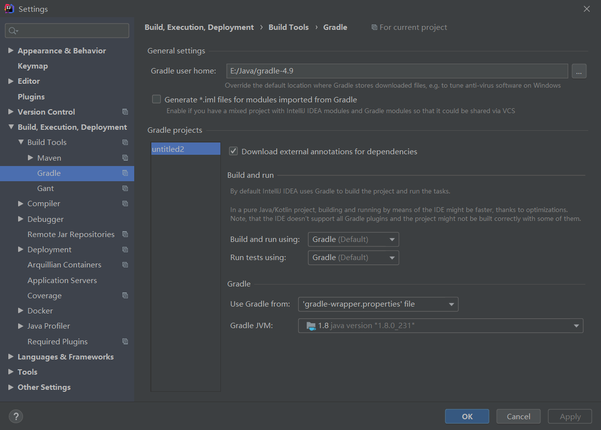

# 下载并配置Gradle

可以去这个网站上下载适合的版本的gradle：[https://gradle.org/releases/](https://gradle.org/releases/)

我的路径是`E:\Java\gradle-4.9`，为了能在其他地方使用gradle命令，需要配置一波环境变量。

新建系统变量：`GRADLE_HOME` = `E:\Java\gradle-4.9`

给path变量添加：`%GRADLE_HOME%\bin`

打开cmd窗口，执行`gradle -v`查看是否安装成功。

# IDEA2020集成Gradle

Gradle默认从中央仓库下载，mavenCentral。

之前按照某个教学视频，配置本地仓库为maven仓库，就是添加环境变量：`GRADLE_USER_HOME`=`E:\Java\maven_repository`

但是可能是我的问题，感觉还是下载有问题。

参考了网上小伙伴：[https://www.jianshu.com/p/ac4b7302200b ](https://www.jianshu.com/p/ac4b7302200b) 的做法，还不错，于是记录一下。

在`E:\Java\gradle-4.9`目录下新建一个文件：init.gradle，并将以下内容写入：

```groovy
allprojects{
    repositories {
        def REPOSITORY_URL = 'http://maven.aliyun.com/nexus/content/groups/public/'
        all { ArtifactRepository repo ->
            def url = repo.url.toString()
            if ((repo instanceof MavenArtifactRepository) && (url.startsWith('https://repo1.maven.org/maven2') || url.startsWith('https://jcenter.bintray.com'))) {
                project.logger.lifecycle 'Repository ${repo.url} replaced by $REPOSITORY_URL .'
                remove repo
            }
        }
        maven {
            url REPOSITORY_URL
        }
    }
}
```

然后添加环境变量：`GRADLE_USER_HOME`=`E:\Java\gradle-4.9`。

IDEA的配置是这样的：



再次打开，将从阿里云的仓库下载依赖，还是比较快的，亲测有效，如果觉得操作过于复杂，还希望小伙伴留言区评论更加简便的做法。