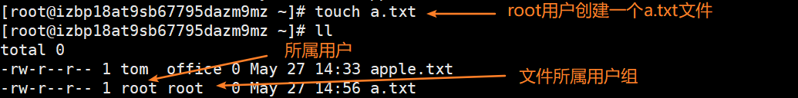
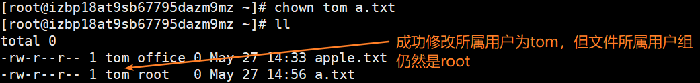
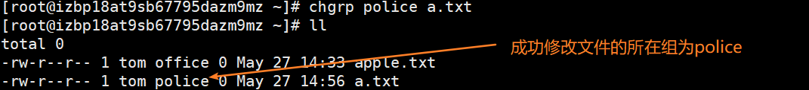
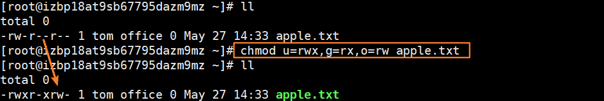
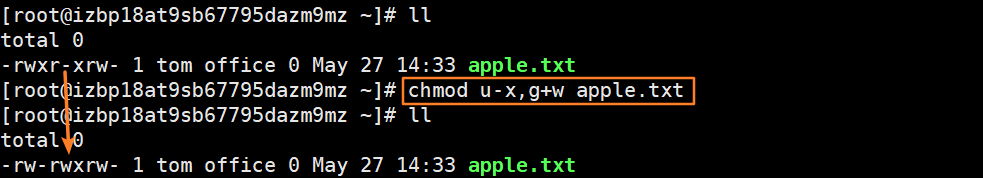
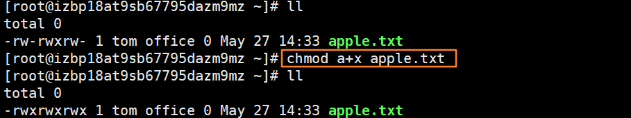
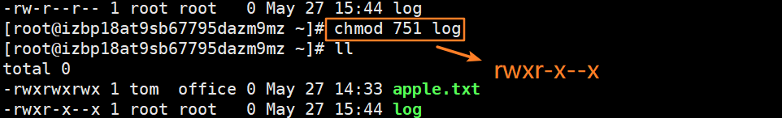

[toc]

# 一、Linux文件概述

上一篇中提到Linux中用户与用户组的概念，每个用户必须属于一个组，不能独立于组外。每个文件或目录都有其所有者，所在组，其他组的概念。

# 二、文件或目录的所有者

也就是创建文件的用户。

## 查看文件的所有者

其实使用`ll`就可以看到文件的具体信息：所属用户和所属用户组。



## 修改文件的所有者

格式：chown 【用户名】 【文件名】



```bash
chown tom -R /home/aa  #C
```

# 三、文件或目录的所在组

文件或目录的所在组默认是创建该文件的用户所属的组。我们刚刚也看到，在用root账户创建了一个a.txt文件之后，改文件所属用户为root，用户所在组为root。

## 修改文件所在的组

格式：chgrp 【组名】 【文件名】



```bash
chgrp -R office /home/aa #将/home/aa下的所有文件或目录所在组改为office
```

# 四、文件基本属性

以我们刚刚创建的a.txt文件为例：

```bash
-rw-r--r-- 1 tom police 0 May 27 14:56 a.txt
```

- -：文件类型（-是普通文件，d是目录，l是软链接，c是字符设备【键盘、鼠标】，b是块文件【硬盘】）。
- rw-：文件所有者权限。
- r--：文件所在组的用户权限。
- r--：文件其他组的用户权限。

- 1：如果是文件，表示硬链接数，如果是目录，则表示子目录个数。
- tom：表示文件所属用户。
- police：表示文件所属用户组。
- 0：表示文件大小，0个字节。
- May 27 14：56：文件最后的修改时间。
- a.txt：文件名。

## rwx权限

- 作用到文件
  - r：可读，可以读取，查看。
  - w：可写，可以修改，但是删除文件需要对该文件所在目录拥有写权限，才能删除文件。
  - x：可执行。

- 作用到目录
  - r：可读，可以查看目录内容。
  - w：可以修改，目录内创建+删除+重命名目录。
  - x：可以进入该目录。

# 五、权限管理指令

## chmod指令修改权限

给apple.txt文件所属用户rwx权限，所在组rx权限，其他组rw权限。



给apple.txt文件所属用户去除x权限，给所在组增加w权限。



给apple.txt文件的所有用户添加x的权限。



使用数字代表rwx权限修改。




