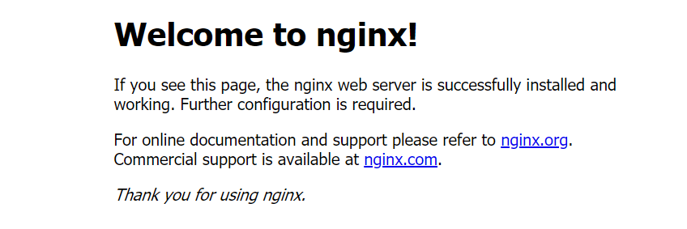

基本上参考这篇文章：[https://blog.csdn.net/u012371097/article/details/82730890](https://blog.csdn.net/u012371097/article/details/82730890)

```bash
# 下载nginx
wget http://nginx.org/download/nginx-1.10.2.tar.gz
# 下载openssl
wget http://www.openssl.org/source/openssl-fips-2.0.10.tar.gz
# 瞎子啊zlib
wget http://zlib.net/zlib-1.2.11.tar.gz
# 下载pcre
wget https://ftp.pcre.org/pub/pcre/pcre-8.13.tar.gz

```

> 下载安装包也可以直接从官网下载，通过ftp工具上传。

如果已经安装gcc环境，则跳过这步：

```bash
yum install gcc-c++
```

解压下载的安装包，分别安装：

```bash
tar -zxvf openssl-fips-2.0.10.tar.gz 
cd openssl-fips-2.0.10
./config && make && make install   #进入文件执行安装程序
```

```bash
tar -xzvf  pcre-8.13.tar.gz
cd pcre-8.13
./configure --enable-utf8 
make && make intall
```

```bash
tar -zxvf zlib-1.2.11.tar.gz
cd zlib-1.2.11
./configure && make && make install
```

```bash
tar zxvf nginx-1.10.2.tar.gz
cd nginx-1.10.2
./configure && make && make install
```

查看nginx的安装地址：

```bash
whereis nginx
# nginx: /usr/bin/nginx /usr/local/nginx
```

进入nginx目录，并启动：

```bash
cd /usr/local/nginx
sbin/nginx
```

> 可能会出现：nginx: [emerg] bind() to 0.0.0.0:80 failed (98: Address already in use) 的错误。参考：[https://www.jianshu.com/p/8f6a42fb0654](https://www.jianshu.com/p/8f6a42fb0654)，杀死80端口的pid，杀死即可。

查看 是否启动成功：

```bash
ps  -ef | grep nginx
```

最后输入ip验证。



设置开机自启：

```bash
vim /etc/rc.d/rc.local

# 加上： /usr/local/nginx/sbin/nginx
```

