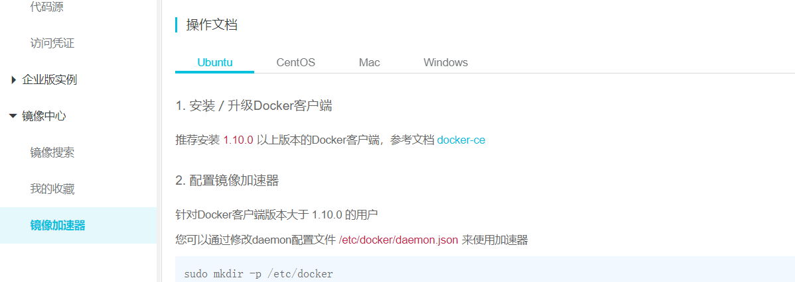

# CentOS7以上版本安装Docker

```bash
uname -r #检查内核版本，需要在3.10之上
yum install docker  #安装
systemctl start docker #启动

docker -v #检查是否安装成功

systemctl enable docker # 设置开机自启

systemctl stop docker  # 停止docker
```

# Docker常用命令

[https://www.runoob.com/docker/docker-run-command.html](https://www.runoob.com/docker/docker-run-command.html)

## 镜像操作

| 操作 | 命令                                            | 说明                                                     |
| ---- | ----------------------------------------------- | -------------------------------------------------------- |
| 检索 | docker  search 关键字  eg：docker  search redis | 我们经常去docker  hub上检索镜像的详细信息，如镜像的TAG。 |
| 拉取 | docker pull 镜像名:tag                          | :tag是可选的，tag表示标签，多为软件的版本，默认是latest  |
| 列表 | docker images                                   | 查看所有本地镜像                                         |
| 删除 | docker rmi image-id                             | 删除指定的本地镜像                                       |

## 容器操作

```bash
docker run -p 8088:8080 --name mytomcat -d tomcat  #后台模式【-d】运行tomcat，指定端口映射【-p】【宿主端口】:【容器端口】

docker ps #查看运行中的容器  【-a】表示查看所有的容器

docker exec -it {id} bash #开启交互模式终端
```

# 开放指定的端口号

参考：[https://www.cnblogs.com/sxmny/p/11224842.html](https://www.cnblogs.com/sxmny/p/11224842.html)

# Docker端口映射或启动容器时报错

Error response from daemon: driver failed programming external connectivity on endpoint quirky_allen

参考：[https://www.cnblogs.com/hailun1987/p/7518306.html](https://www.cnblogs.com/hailun1987/p/7518306.html)

原因：docker服务启动时定义的自定义链DOCKER由于某种原因被清掉，重启docker服务及可重新生成自定义链DOCKER。

```bash
# 重启docker服务后再启动容器
systemctl restart docker
docker start foo
```

# 客户端远程连接docker容器中的mysql 报1251错误

[https://blog.csdn.net/a15123837995/article/details/83751612](https://blog.csdn.net/a15123837995/article/details/83751612)

```bash
# 启动容器
[root@localhost /]# docker run -d -e MYSQL_ROOT_PASSWORD=123456 -p 3306:3306 mysql
# 进入容器
[root@localhost /]# docker exec -it 5213aeb76200 bash
# 进入mysql，输入密码
root@5213aeb76200:/# mysql -u root -p
# 授权远程连接
mysql> GRANT ALL ON *.* TO 'root'@'%';
# 更改密码加密规则
mysql> ALTER USER 'root'@'%' IDENTIFIED BY 'password' PASSWORD EXPIRE NEVER;
# 更改root密码
mysql> ALTER USER 'root'@'%' IDENTIFIED WITH mysql_native_password BY '123456'; 
# 刷新权限
mysql> flush privileges;
```

# Error response from daemon: oci runtime error: container_linux.go:235: starting container process ...

使用阿里云的Centos7云服务器使用docker时出现如下错误。参考该博客，使用`yum update`，问题解决：[https://blog.csdn.net/liqun_super/article/details/88304094](https://blog.csdn.net/liqun_super/article/details/88304094)

# 配置Docker国内镜像源

可以配置使用阿里云镜像，提升拉取速度：[https://cr.console.aliyun.com/cn-hangzhou/instances/mirrors](https://cr.console.aliyun.com/cn-hangzhou/instances/mirrors)



```bash
vim /etc/docker/daemon.json

{
  "registry-mirrors": ["https://xxx.mirror.aliyuncs.com"]
}

systemctl daemon-reload
systemctl restart docker
```

# Centos7开放指定端口

```bash
firewall-cmd --zone=public --add-port=6379/tcp --permanent
firewall-cmd --reload
firewall-cmd --query-port=6379/tcp
```

# Centos7设置防火墙开机自启和禁止开机自启

[https://www.cnblogs.com/crazycode2/p/11333003.html](https://www.cnblogs.com/crazycode2/p/11333003.html)

```bash
systemctl enable firewalld #设置自启
systemctl disable firewalld #禁止自启
```

# Docker安装Redis完整过程及配置远程连接&踩坑注意事项

[https://blog.csdn.net/u010358168/article/details/97143703](https://blog.csdn.net/u010358168/article/details/97143703)

# Docker容器启动失败 Failed to start Docker Application Container Engine.

[https://blog.csdn.net/sdrfengmi/article/details/87929593](https://blog.csdn.net/sdrfengmi/article/details/87929593)