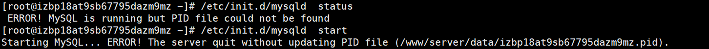
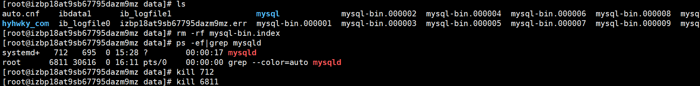

前段时间购买了学生云服务器，又申请了域名，想搭建一个简易的个人博客玩玩，期间踩过许多坑，但最终通过我的不懈努力，终于是完成了我的初步搭建。

大部分的步骤都是按照b站视频上操作的：[https://www.bilibili.com/video/BV1uE411u7a7?t=2998](https://www.bilibili.com/video/BV1uE411u7a7?t=2998)

一路都十分顺利，直到设置数据库信息那一部分，出现了错误：

在添加数据库的时候出现了：**数据库连接失败,请检查数据库服务是否启动!**

再参考了这篇博客[https://www.bt.cn/bbs/thread-31459-1-2.html](https://www.bt.cn/bbs/thread-31459-1-2.html)的其中一个评论后，通过`/etc/init.d/mysqld start`命令，试图启动数据库服务。但又出现了以下错误：



接着参考了这篇博客：[MySQL is running but PID file could not be found（解决方法）](https://blog.csdn.net/weixin_39036700/article/details/81094399)



然后启动成功，果然在宝塔面板中添加数据库成功！

此时在拷贝一份`wp-config-sample.php`并重命名为`wp-config.php`，里面设置信息即可：

```php
// ** MySQL settings - You can get this info from your web host ** //
/** The name of the database for WordPress */
define( 'DB_NAME', 'database——name' );

/** MySQL database username */
define( 'DB_USER', 'username' );

/** MySQL database password */
define( 'DB_PASSWORD', 'password' );

/** MySQL hostname */
define( 'DB_HOST', 'hostname' );

/** Database Charset to use in creating database tables. */
define( 'DB_CHARSET', 'utf8' );

/** The Database Collate type. Don't change this if in doubt. */
define( 'DB_COLLATE', '' );
```

成功！

其他坑：**WordPress安装插件提示：发生了预料之外的错误。WordPress.org或是此服务器的配置可能出了一些问题。**

[https://www.ludou.org/wordpress-an-unexpected-error-occurred.html](https://www.ludou.org/wordpress-an-unexpected-error-occurred.html)

Linux服务器下运行命令：`vim /etc/resolv.conf`
在里面加入以下两行内容：
`nameserver 8.8.8.8`
`nameserver 8.8.4.4`

