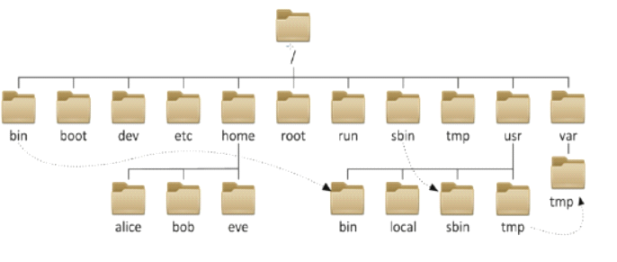
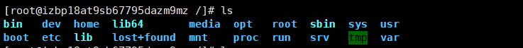
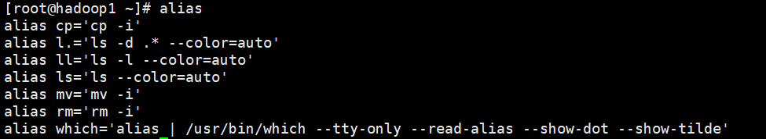
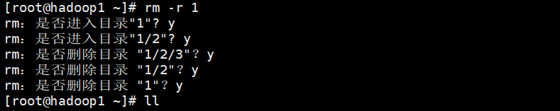

# 目录结构

> 在Linux中，一切皆文件。

在 Linux 或 Unix 操作系统中，所有的文件和目录都被组织成以一个根节点开始的倒置的树状结构。

文件系统的最顶层是由根目录开始的，系统使用` / `来表示根目录。在根目录之下的既可以是目录，也可以是文件，而每一个目录中又可以包含子目录文件。如此反复就可以构成一个庞大的文件系统。

|       目录       |                        信息                        |
| :--------------: | :------------------------------------------------: |
|      /root       |               超级权限者的用户主目录               |
| /home/{UserName} |       用户的主目录，每个用户都拥有自己的目录       |
|       /bin       |          普通用户的可执行文件（常用命令）          |
|      /sbin       |               系统管理员的可执行文件               |
|       /etc       |                    配置文件目录                    |
|       /usr       | 存放应用程序和文件，类似于windows下的program files |
|      /boot       |                   内核和启动文件                   |
|    /var，/srv    |                     服务器数据                     |
|   /proc，/sys    |                      系统信息                      |
|       /lib       |      动态连接共享库，类似于Windows中的dll文件      |
|       /tmp       |                      临时文件                      |
|       /dev       |                  Linux的外部设备                   |
|   /lost+found    |         一般为空，系统非法关机后，存放文件         |
|       /run       |        临时文件系统，存储系统启动以来的信息        |
|       /opt       |           给主机额外安装软件所摆放的目录           |
|   /media，/mnt   |                     其他挂载点                     |

## 两个特殊的目录

1. 一个用户所在的工作目录，也叫**当前目录**，可以使用一个点 `.` 来表示，也可以使用` ./ `来表示；。
2. 另一个是当前目录的上一级目录，也叫**父目录**，可以使用两个点 `..` 来表示，也可以 `../ `来代表。

> 如果一个目录或文件名以一个点 . 开始，表示这个目录或文件是一个隐藏目录或文件(如：.bashrc)。
>
> 即以默认方式查找时，不显示该目录或文件。

# 绝对路径与相对路径

绝对路径：以/（根目录）开始的路径。

相对路径：相对于当前位置而出发的路径。

# 命令提示符

`[root@hadoop1 ~]# `

- root：当前登录到系统的用户名
- @hadoop1：当前系统的主机名
- ~ ：当前用户的所在位置，~表示家目录
- #：Linux系统中最高的权限表示符号，root账户拥有该权限（普通用户权限$）

 # 命令的书写格式

命令字 【命令选项】【命令参数】

三者之间以空格分隔，以回车结束命令。

命令必须存在，但选项和参数不一定需要：ifconfig，setup

命令执行的时候可以同时执行多个选项和多个参数，多个参数之间

# 获取命令帮助

--help

man

# 常用命令

pwd：

