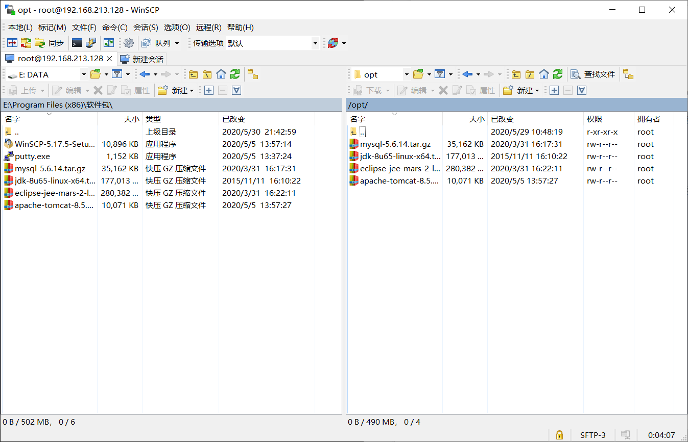
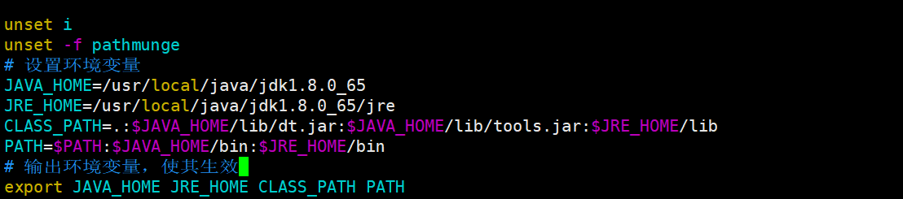
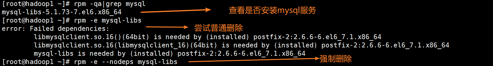

[toc]

需要软件：WinSCP(文件上传)，XShell6(SSH终端)

环境：CentOS6.8

# 一、JDK安装

参考：[https://www.cnblogs.com/wjup/p/11041274.html](https://www.cnblogs.com/wjup/p/11041274.html)

## 1、通过压缩包安装JDK

需要压缩包：JDK1.8压缩包

1、通过Xshell链接Linux远程服务器


2、通过文件上传工具WinSCP上传jdk压缩包



此时进入`/opt`目录，查看压缩包是否已经上传：


3、创建`/usr/local/java`目录，将文件解压到该目录中

```bash
mkdir /usr/local/java
tar -zxvf jdk-8u65-linux-x64.tar.gz -C /usr/local/java 
```

4、编辑`vim /etc/profile`，加入JAVA_HOME、JRE_HOME、CLASSPATH等配置，并使配置生效。

```bash
# 设置环境变量
JAVA_HOME=/usr/local/java/jdk1.8.0_65
JRE_HOME=/usr/local/java/jdk1.8.0_65/jre
CLASS_PATH=.:$JAVA_HOME/lib/dt.jar:$JAVA_HOME/lib/tools.jar:$JRE_HOME/lib
PATH=$PATH:$JAVA_HOME/bin:$JRE_HOME/bin
# 输出环境变量，使其生效
export JAVA_HOME JRE_HOME CLASS_PATH PATH
```



```bash
source /etc/profile # 使配置生效
```

5、测试查看Java版本信息。


## yum安装

1、查看Java相关可安装包

```bash
yum -y list java* 
# 或
yum search jdk
```

2、安装jdk：

```bash
yum install java-1.8.0-openjdk.x86_64
```

3、安装之后可以验证：`java -version`

4、通过yum安装默认路径在`/usr/lib/jvm`

5、修改配置文件，将jdk的安装路径加入JAVA_HOME。

```bash
JAVA_HOME=/usr/lib/jvm/jre-1.6.0-openjdk.x86_64
PATH=$PATH:$JAVA_HOME/bin
CLASSPATH=.:$JAVA_HOME/lib/dt.jar:$JAVA_HOME/lib/tools.jar
export JAVA_HOME CLASSPATH PATH
```

6、使配置生效：`. /etc/profile`

# 二、MySQL安装

需要压缩包：mysql5.6

1、安装前确认是否已经安装mysql服务，如果有的话，将其删除。

```bash
rpm -qa | grep mysql
rpm -e mysql-libs   #普通删除模式
rpm -e --nodeps mysql-libs #强制删除
```



2、安装编译代码需要的包

```bash
yum -y install make gcc-c++ cmake bison-devel  ncurses-devel
```

3、创建`/usr/local/mysql`目录，将文件解压到该目录中

```bash
mkdir /usr/local/mysql
tar -zxvf mysql-5.6.14.tar.gz -C /usr/local/mysql
```

4、编译安装源码

```bash
cd /usr/local/mysqlmysql-5.6.14
cmake -DCMAKE_INSTALL_PREFIX=/usr/local/mysql -DMYSQL_DATADIR=/usr/local/mysql/data -DSYSCONFDIR=/etc -DWITH_MYISAM_STORAGE_ENGINE=1 -DWITH_INNOBASE_STORAGE_ENGINE=1 -DWITH_MEMORY_STORAGE_ENGINE=1 -DWITH_READLINE=1 -DMYSQL_UNIX_ADDR=/var/lib/mysql/mysql.sock -DMYSQL_TCP_PORT=3306 -DENABLED_LOCAL_INFILE=1 -DWITH_PARTITION_STORAGE_ENGINE=1 -DEXTRA_CHARSETS=all -DDEFAULT_CHARSET=utf8 -DDEFAULT_COLLATION=utf8_general_ci
```

5、编译并安装

```bash
make && make install #这步等待时间较长
```

6、查看是否已经存在mysql用户及用户组，没有则创建，并修改权限

```bash
cat /etc/passwd #查看用户列表
cat /etc/group  #查看用户组列表
```

```bash
groupadd mysql
useradd -g mysql mysql
# 修改/usr/local/mysql权限
chown -R mysql:mysql /usr/local/mysql
```

7、初始化配置，进入安装路径，执行初始化配置脚本，创建系统自带的数据库和表

```bash
cd /usr/local/mysql
scripts/mysql_install_db --basedir=/usr/local/mysql --datadir=/usr/local/mysql/data --user=mysql
```

8、在启动MySQL服务时，会按照一定次序搜索`my.cnf`，先在`/etc`目录下找，找不到则会搜索`$basedir/my.cnf`，在本例中就是` /usr/local/mysql/my.cnf`，因此，如果存在`/etc/my.cnf`，需要修改其名字，防止冲突。

```bash
mv /etc/my.cnf /etc/my.cnf.bak
```

9、添加服务，拷贝服务脚本到init.d目录，并设置开机启动 

```bash
cd /usr/local/mysql
cp support-files/mysql.server /etc/init.d/mysql  #拷贝服务脚本
chkconfig mysql on  # 设置开机启动 
service mysql start # 启动服务
```

10、配置path路径，将bin目录路径加入path。

```bash
vim /etc/profile
PATH=$PATH:$JAVA_HOME/bin:$JRE_HOME/bin:/usr/local/mysql/bin
source /etc/profile
```

11、执行mysql指令

```bash
mysql -u root
mysql> set password = password('123456');
```

12、成功！