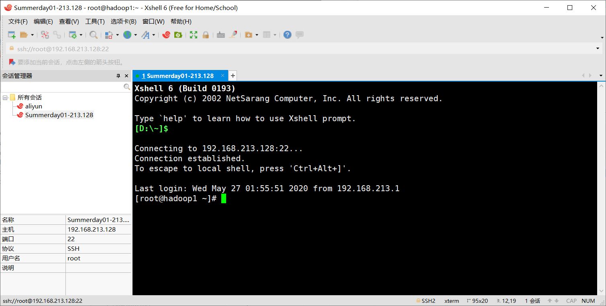

[toc]

需要软件：WinSCP(文件上传)，XShell6(SSH终端)

环境：CentOS6.8

# 一、JDK安装

参考：[https://www.cnblogs.com/wjup/p/11041274.html](https://www.cnblogs.com/wjup/p/11041274.html)

## 1、通过压缩包安装JDK

需要压缩包：JDK1.8压缩包

1、通过Xshell链接Linux远程服务器



2、通过文件上传工具WinSCP上传jdk压缩包


此时进入`/opt`目录，查看压缩包是否已经上传：


3、创建`/usr/local/java`目录，将文件解压到该目录中

```bash
mkdir /usr/local/java
tar -zxvf jdk-8u65-linux-x64.tar.gz -C /usr/local/java 
```

4、编辑`vim /etc/profile`，加入JAVA_HOME、JRE_HOME、CLASSPATH等配置，并使配置生效。

```bash
# 设置环境变量
JAVA_HOME=/usr/local/java/jdk1.8.0_65
JRE_HOME=/usr/local/java/jdk1.8.0_65/jre
CLASS_PATH=.:$JAVA_HOME/lib/dt.jar:$JAVA_HOME/lib/tools.jar:$JRE_HOME/lib
PATH=$PATH:$JAVA_HOME/bin:$JRE_HOME/bin
# 输出环境变量，使其生效
export JAVA_HOME JRE_HOME CLASS_PATH PATH
```


```bash
source /etc/profile # 使配置生效
```

5、测试查看Java版本信息。


## yum安装

1、查看Java相关可安装包

```bash
yum -y list java* 
# 或
yum search jdk
```

2、安装jdk：

```bash
yum install java-1.8.0-openjdk.x86_64
```

3、安装之后可以验证：`java -version`

4、通过yum安装默认路径在`/usr/lib/jvm`

5、修改配置文件，将jdk的安装路径加入JAVA_HOME。

```bash
JAVA_HOME=/usr/lib/jvm/jre-1.6.0-openjdk.x86_64
PATH=$PATH:$JAVA_HOME/bin
CLASSPATH=.:$JAVA_HOME/lib/dt.jar:$JAVA_HOME/lib/tools.jar
export JAVA_HOME CLASSPATH PATH
```

6、使配置生效：`. /etc/profile`

# 二、MySQL安装

需要压缩包：mysql5.6

1、安装前确认是否已经安装mysql服务，如果有的话，将其删除。

```bash
rpm -qa | grep mysql
rpm -e mysql-libs   #普通删除模式
rpm -e --nodeps mysql-libs #强制删除
```