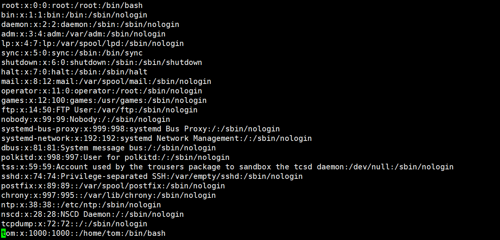

[toc]

# 一、用户管理

## 1、用户创建

useradd 【选项】 {UserName}

| 选项 参数 | 信息     |
| ---- | ---- |
|  -c comment    |   指定一段注释性描述     |
|   -d 目录    |    指定用户主目录，如果目录不存在，则同时使用-m选项，可以创建主目录。  |
|   -g 用户组    |    指定用户所属的用户组。  |
|   -G 用户组,用户组   |   指定用户所属的附加组。   |
|  -s Shell文件     |  指定用户的登录Shell。    |
|   -u 用户号    |   指定用户的用户号   |

创建用户

```bash
useradd tom
```

系统默认创建，用户的加目录所在位置在`/home/tom`

```bash
vi /etc/passwd
```

UID，账户名，家目录，Shell程序



【需求一】：创建一个普通用户，其家目录在`/summer/my`，主组为root。

> 注意：-m虽然可以创建目录，但只能创建一级，因此想要指定多级目录且，需要实现创建summer目录。

```bash
mkdir /summer 
useradd -d /summer/my -m -g -root my
```

可以进入my的加目录，pwd查看

```bash
cd ~my
pwd 
/summer/my
```

【需求二】：创建一个普通用户用户名为hyh，主组root，附加组tom，adm，UID为600，执行用户的shell程序为`/bin/sh`

```bash
useradd -g root -G adm,bin -u 600 -s /bin/sh hyh
```

可以通过查看passwd文件内容查看：

```bash
hyh:x:600:0::/home/hyh:/bin/sh
```

可以通过以下命令查看附加组信息：

```bash
id hyh
uid=600(hyh) gid=0(root) groups=0(root),1(bin),4(adm)
```

## 2、用户修改

usermod 【选项】 {UserName}

追加用户的附加组：

```bash
usermod -aG ftp hyh
```

## 3、用户删除

userdel 【选项】 {UserName}

```bash
userdel -r us
```

`/home`目录中的us的家目录也会被删除。如果没有-r 选项，`/home`目录下依然会保留us的家目录。

# 二、密码管理

passwd 【选项】 {UserName}

| 选项 | 信息           |
| ---- | -------------- |
| -l   | 锁定账户，禁用 |
| -u   | 解锁账户       |
| -d   | 删除密码       |

- passwd如果不跟上用户名，标识修改当前账户的密码，如果跟上用户名，表示修改他人的密码，此时需要管理员权限。

- 普通用户修改密码时，需要高强度密码【8位，大小写，数字，与姓名生日不同】要求，管理员修改密码时，则不需要。

- 锁定账户和删除密码都会造成不允许该用户登录的情况。

# 三、用户切换

| 选项            | 信息                                 |
| --------------- | ------------------------------------ |
| su {UserName}   | 表示切换用户之后，依然停留在当前目录 |
| su - {UserName} | 表示切换用户之后，去到该用户的家目录 |

```bash
[root@izbp18at9sb67795dazm9mz ~]# su hyh
[hyh@izbp18at9sb67795dazm9mz root]$ 
```

```bash
[root@izbp18at9sb67795dazm9mz ~]# su - hyh
Last login: Mon May 25 15:11:49 CST 2020 on pts/0
[hyh@izbp18at9sb67795dazm9mz ~]$
```

# 四、用户组管理

## 1、用户组创建

groupadd 【选项】 {GroupName}

| 选项 参数 | 信息                                               |
| --------- | -------------------------------------------------- |
| -g GID    | 指定新用户组的GID                                  |
| -o        | 通常与-g同时使用，使新用户组可以与系统已有的组ID系 |

【需求】：创建一个新的用户组group1，GID为520。

```bash
groupadd -g 520 group1
```

可以使用`#bash cat /etc/group `查看用户组的信息。

【需求】：创建一个用户组group2，GID和group1的相同。

```bash
groupadd -g 520 -o group1
```

## 2、用户组修改

groupmod 【选项】 {GroupName}

| 选项 参数 | 信息                                               |
| --------- | -------------------------------------------------- |
| -g GID    | 指定用户组新的GID                                  |
| -o        | 通常与-g同时使用，使新用户组可以与系统已有的组ID系 |
| -n        | 为用户组改名                                       |

【需求】：将group1用户组改名为group3，将GID修改为521。

```bash
groupmod -g 521 -o -n group3 group1
```

## 3、用户组删除

groupdel 【选项】 {GroupName}

- 如果删除的用户组，已经被用户追加为附件组，对应的所有用户的该附件组会被撤销掉。
- 如果被删除的用户组，已经被用户指定为主组，则该用户组无法被删除。(可以理解为Windows中文件被占用时不能被删除。)

# 四、用户组切换

如果一个用户同时属于多个用户组，那么用户可以在用户组之间切换，以便具有其他用户组的权限。

```bash
newgrp {GroupName}
```

